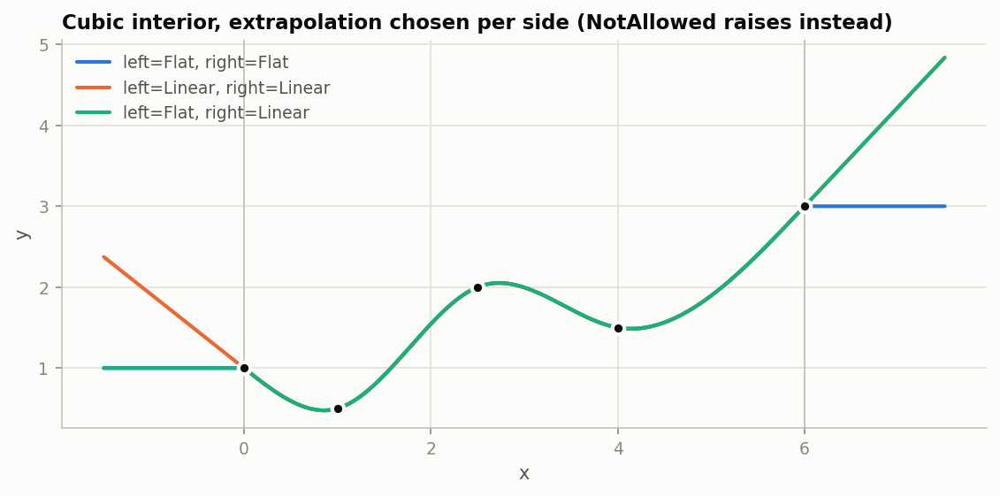
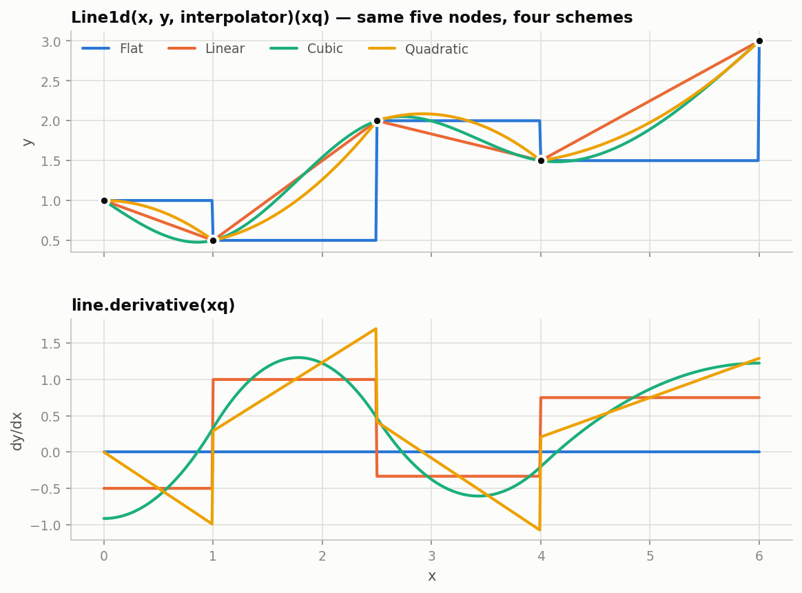
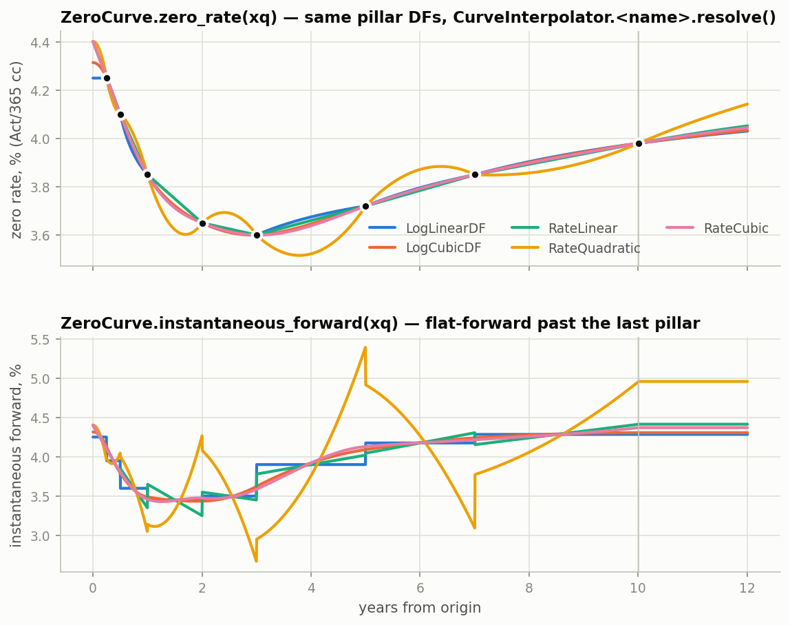
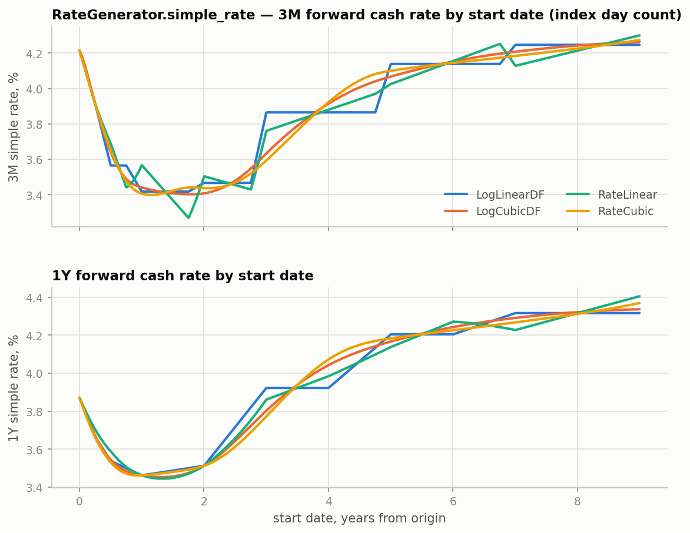
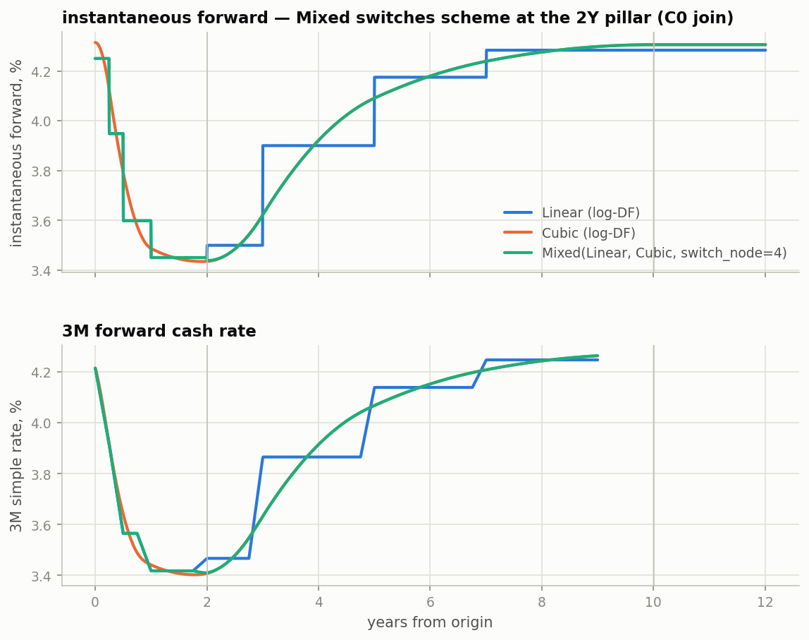

# Curves: `Line1d`, `ZeroCurve`, `YieldCurve`

Three layers. Each one adds exactly one concept.

```text
common.math.line.Line1d          nodes (x, y) + interpolator + extrapolation per side
        |
        |  in log-DF or zero-rate space, DF invariants (x[0] == 0, dfs[0] == 1, dfs > 0)
        v
finance.markets.curves.ZeroCurve discount factors on float day offsets
        |
        |  + origin date, index conventions, historical fixings
        v
finance.markets.curves.YieldCurve the market object: dates in, rates out
```

`Line1d` knows nothing about finance. `ZeroCurve` knows nothing about dates.
`YieldCurve` is the only layer that sees a calendar.

Figures are generated by `research/curve_doc_figures.py`, which also prints every value
quoted below.

## Conventions used in this document

| Name | Type | Meaning |
|---|---|---|
| `x`, `xq` | `float64[n]` | node positions / query positions. For curves: days from the origin. |
| `y` | `float64[n]` | node values in whatever space the line interpolates |
| `dfs` | `float64[n]` | discount factors at the pillars, `dfs[0] == 1.0` |
| `dates` | `datetime64[D][n]` | calendar dates; only `YieldCurve` accepts them |
| `line`, `zc`, `yc` | | a `Line1d`, a `ZeroCurve`, a `YieldCurve` |

Arrays are 1-D float64 and are not cast on the way in. Convert dates to `x` before
touching `ZeroCurve`; `YieldCurve.to_x(dates)` does it.

```python
import numpy as np

from common.math.interpolation import Cubic, Flat, Linear, Mixed, Quadratic
from common.math.line import Extrapolation, Line1d
from finance.markets.curves import CurveInterpolator, CurveSpace, RateExtrapolator, YieldCurve, ZeroCurve
```

## 1. `Line1d`

### Construction

```python
x = np.array([0.0, 1.0, 2.5, 4.0, 6.0])
y = np.array([1.0, 0.5, 2.0, 1.5, 3.0])

line = Line1d(x, y, Linear())                                   # left/right default to NotAllowed
line = Line1d(x, y, Cubic(), left=Extrapolation.Flat, right=Extrapolation.Linear)
```

`x` must be 1-D, finite, strictly increasing. `y` must match its shape and be finite. A
single node is accepted; only `Flat` can interpolate it. Violations raise `ValueError` at
construction.

The interpolator is fitted once, here. Queries only evaluate.

### Query

A line is callable. Queries are arrays of the same kind as `x`.

```python
line = Line1d(x, y, Linear())
line(np.array([0.5, 1.75, 6.0]))          # -> [0.75, 1.25, 3.0]
line.get_value(np.array([0.5]))           # alias of __call__
```

### Extrapolation

Chosen independently per side. Three modes:

| `Extrapolation` | Beyond the end node |
|---|---|
| `NotAllowed` | raise `ValueError` with the count of offending points and the furthest one |
| `Flat` | hold the end node's value |
| `Linear` | continue the fitted interpolant's end slope |

```python
line(np.array([6.5, 9.0]))
# ValueError: 2 query point(s) beyond the last node x=6.0 (furthest: 9.0); extrapolation is not allowed.

ext = Line1d(x, y, Linear(), left=Extrapolation.Flat, right=Extrapolation.Linear)
ext(np.array([-2.0, 8.0]))                # -> [1.0, 4.5]   (held at y[0]; last slope 0.75 continued)
```



### Interpolators

An interpolator is a frozen value object holding a scheme and its parameters. `fit(x, y)`
binds it to nodes. You never call `fit` yourself; `Line1d` does.

| Scheme | Parameters | Interpolates | Local? | Notes |
|---|---|---|---|---|
| `Flat()` | none | previous node's value holds on `[x[i], x[i+1])` | yes | fixings: Friday's print covers Saturday and Sunday |
| `Linear()` | none | straight line between nodes | yes | in log-DF space this is piecewise-flat forwards |
| `Cubic(bc_type="natural")` | scipy `CubicSpline` `bc_type` | C2 cubic spline | no | `"natural"`, `"clamped"`, `"not-a-knot"`, or `((order, value), (order, value))` |
| `Quadratic(left_slope=0.0, right_slope=0.0)` | end slopes | piecewise quadratic, blended forward/backward sweeps | no | C0; C1 only where the sweeps agree |
| `Mixed(short, long, switch_node)` | two interpolators, a node index | `short` up to `x[switch_node]`, `long` after | per segment | C0 at the join; segments fit independently |

Local means a node moves only its two adjacent intervals. The calibrator's sequential
bootstrapper requires a local scheme.

```python
Cubic()                                    # natural: zero second derivative at both ends
Cubic(bc_type="clamped")                   # zero first derivative at both ends
Cubic(bc_type=((2, 0.5), (1, 0.0)))        # second derivative 0.5 on the left, zero slope on the right
Quadratic(left_slope=0.35)
Mixed(Linear(), Cubic(), switch_node=2)    # both segments share node 2
```



The lower panel is `line.derivative(xq)`. `Flat` is zero everywhere, `Linear` is a step
function, `Cubic` is smooth, `Quadratic` is continuous in value but jumps in slope where
the sweeps disagree. This is the panel to look at when choosing a scheme for a curve,
because in log-DF space the derivative is the instantaneous forward.

### Derivative and coefficients

```python
line = Line1d(x, y, Linear())
line.derivative(np.array([0.5, 1.75]))    # -> [-0.5, 1.0]
line.coefficients                          # (2, 4): row 0 slopes, row 1 y[:-1]
# [[-0.5,  1.0, -0.333, 0.75],
#  [ 1.0,  0.5,  2.0,   1.5 ]]

Line1d(x, y, Cubic()).coefficients.shape   # -> (4, 4)
```

`coefficients` is the scipy `PPoly` layout: shape `(degree + 1, n_intervals)`, highest
power first, each piece in `x - x[i]`. Evaluation anywhere is `searchsorted` + Horner on
this array. This is what the Numba and JAX engines take from a curve; they never call
`Line1d` inside a kernel.

### Rebinding: `with_y`

```python
line.with_y(y * 2)(np.array([1.75]))      # -> [2.5]
```

Same `x`, interpolator and extrapolation; new node values. Skips the `x` checks (they
cannot have changed) and refits. The original is untouched. Calibration and
bump-and-reprice risk use this path on every iteration.

## 2. `ZeroCurve`

A `Line1d` on day offsets in a declared space, plus the discount-factor invariants.

### Space

| `CurveSpace` | `y` stored in the line | `Linear()` means | flat-forward extrapolation is |
|---|---|---|---|
| `LogDF` (default) | `ln DF(x)` | piecewise-constant instantaneous forward | `Extrapolation.Linear` on the line |
| `ZeroRate` | `r(x)`, Act/365 continuously compounded | linear zero rate, forwards jump at pillars | `f(T) = r(T) + T r'(T)` continued |

The space owns the transform to and from DF. The interpolator never sees a discount factor.

### Construction and queries

```python
origin_x = 0.0
x = np.array([0., 92., 183., 365., 731., 1096., 1826., 2557., 3653.])   # days from origin
z = np.array([0.0, 0.0425, 0.0410, 0.0385, 0.0365, 0.0360, 0.0372, 0.0385, 0.0398])
dfs = np.exp(-z * x / 365.0)
dfs[0] = 1.0

zc = ZeroCurve(x, dfs)                     # LogDF, Linear(), FlatForward
zc
# ZeroCurve(nodes=9, max_x=3653, space=LogDF, interpolator=Linear(), extrapolation=FlatForward)

xq = np.array([0.0, 182.0, 365.0, 3650.0, 4000.0])
zc.discount_factor(xq)                     # -> [1.0, 0.97976, 0.962232, 0.671679, 0.64465]
zc.log_discount_factor(xq)
zc.zero_rate(xq)                           # -> [0.0425, 0.041008, 0.0385, 0.039798, 0.040063]
zc.instantaneous_forward(xq)               # -> [0.0425, 0.039484, 0.034505, 0.042833, 0.042833]
zc.node_zero_rates                         # -> z[1:]   (the calibration parameters)
```

Invariants checked at construction: `x[0] == 0.0`, `dfs[0] == 1.0`, all `dfs` finite and
positive, `x` strictly increasing. Queries before the origin (`xq < 0`) raise.

`zero_rate` at `x = 0` is the limit `-ln DF / t`, the instantaneous forward at the origin,
not a division by zero.

Any scheme in either space:

```python
rc = ZeroCurve(x, dfs, space=CurveSpace.ZeroRate, interpolator=Cubic())
rc
# ZeroCurve(nodes=9, max_x=3653, space=ZeroRate, interpolator=Cubic(bc_type='natural'), extrapolation=FlatForward)
rc.zero_rate(xq)                           # -> [0.044016, 0.041016, 0.0385, 0.039797, 0.040138]
```

Note `rc.zero_rate(0.0)` differs from `zc`'s: in rate space the origin value is the spline's
extrapolation of the first two pillar rates, in log-DF space it is the first interval's
forward. Both are "the rate at t = 0" under their own scheme.



Same pillars, five named schemes. Zero rates agree at the pillars by construction and
differ between them. The forward panel is where schemes are chosen: `LogLinearDF` steps,
the cubics are smooth, `RateLinear` saw-tooths, `RateQuadratic` overshoots on this ladder.
Past the last pillar every scheme continues its own terminal forward.

### Extrapolation

`RateExtrapolator.FlatForward` (default) continues the instantaneous forward at the last
pillar, computed from the interpolant's exact end derivative. `RateExtrapolator.NotAllowed`
raises beyond the last pillar. Queries before the origin always raise.

```python
ZeroCurve(x, dfs, extrapolation=RateExtrapolator.NotAllowed).discount_factor(np.array([4000.0]))
# ValueError: 1 query point(s) beyond the last node x=3653.0 ...
```

### Rebinding: `with_dfs`

```python
z_bumped = z + 1e-4
dfs_bumped = np.exp(-z_bumped * x / 365.0)
dfs_bumped[0] = 1.0
bumped = zc.with_dfs(dfs_bumped)           # same x, space, interpolator, extrapolation
```

Same pillars and configuration, new discount factors, no geometry re-validation. This is
the calibrator's per-iteration step and the risk engine's per-pillar bump.

### Engine hand-off

```python
zc.is_log_linear                           # True: LogDF space and Linear()
zc.x                                       # pillar offsets, origin-inclusive
zc.node_zero_rates                         # z at the non-origin pillars
zc.line.coefficients                       # (2, 8) for Linear; (4, 8) for Cubic
```

The Numba and JAX programs model log-linear DF only today and check `is_log_linear`; the
risk engine falls back to bump-and-reprice for anything else. Extending a kernel to another
scheme is a Horner branch on `line.coefficients` plus matching analytic weights for the
adjoint.

### `CurveInterpolator`: the parse table

Named `(space, interpolator)` pairs for config and Excel. Code that constructs curves
directly passes a space and an interpolator instance instead.

```python
CurveInterpolator.RateCubic.resolve()      # -> (CurveSpace.ZeroRate, Cubic(bc_type='natural'))
space, interpolator = CurveInterpolator["LogLinearDF"].resolve()
ZeroCurve(x, dfs, space=space, interpolator=interpolator)
```

| Member | Space | Interpolator |
|---|---|---|
| `LogLinearDF` | `LogDF` | `Linear()` |
| `LogCubicDF` | `LogDF` | `Cubic()` |
| `RateLinear` | `ZeroRate` | `Linear()` |
| `RateQuadratic` | `ZeroRate` | `Quadratic()` |
| `RateCubic` | `ZeroRate` | `Cubic()` |

## 3. `YieldCurve`

Origin date, a `ZeroCurve`, the index conventions, optional fixings.

### Construction

Dates in:

```python
node_dates = np.array(
    ["2026-06-01", "2026-09-01", "2026-12-01", "2027-06-01", "2028-06-01",
     "2029-06-01", "2031-06-01", "2033-06-01", "2036-06-01"],
    dtype="datetime64[D]",
)
yc = YieldCurve.build(node_dates, dfs, currency="USD", index_name="SOFR")
yc
# YieldCurve(name='USD.SOFR', origin=2026-06-01, zero_curve=ZeroCurve(nodes=9, max_x=3653, ...))

YieldCurve.build(node_dates, dfs, currency="USD", index_name="SOFR",
                 space=CurveSpace.ZeroRate, interpolator=Cubic(),
                 extrapolation=RateExtrapolator.NotAllowed)
```

The first node date is the origin. The rest become the `ZeroCurve` pillars. Conventions
come from the `ConventionRegistry` (default registry unless `registry=` is passed).

From an existing `ZeroCurve`, which is what the calibrator hands back:

```python
result = CurveCalibrator(helpers, GlobalSolver(), definition).calibrate(base_market)
yc = YieldCurve.from_registry(result.origin, result.zero_curve, currency="USD", index_name="SOFR")
```

Scenario copies keep origin, conventions and fixings:

```python
yc.with_zero_curve(zc.with_dfs(dfs_bumped))
yc.with_historical_fixings(history)
```

### Dates to `x`

```python
dates = np.array(["2026-06-01", "2027-06-01", "2040-06-01"], dtype="datetime64[D]")
yc.to_x(dates)                             # -> [0.0, 365.0, 5114.0]
yc.discount_factor(dates)                  # -> [1.0, 0.962232, 0.565652]
yc.zero_rate(dates)                        # -> [0.0425, 0.0385, 0.040666]
yc.log_discount_factor(dates)
yc.instantaneous_forward(dates)

yc.node_dates                              # pillar dates, origin first
yc.max_date
```

Every date query is `self.zero_curve.<method>(self.to_x(dates))`. `dates_to_x(origin, dates)`
is the same function exposed at module level for callers holding an origin and a
`ZeroCurve` without a `YieldCurve` (the Excel adapter does this).

### `node_index`

Maps a `Term` from the origin, or a date, to the pillar index. Raises if no pillar falls
there. Use it to place a `Mixed` switch.

```python
from finance.dates import Term

yc.node_index(Term.from_str("2Y"))         # -> 4
yc.node_index(np.datetime64("2031-06-01")) # -> 6
yc.node_index(Term.from_str("30Y"))        # ValueError: no curve pillar on 2056-06-01; pillars are [...]
```

### Fixings

`HistoricalFixings` is a `Line1d` with `Flat()` and flat extrapolation both sides. A fixing
holds until the next print: Friday's covers Saturday and Sunday, Monday's takes over on
Monday.

```python
from finance.markets import HistoricalFixings, RateGenerator

history = HistoricalFixings(
    dates=np.array(["2026-05-27", "2026-05-29"], dtype="datetime64[D]"),
    values=np.array([0.0428, 0.0431]),
)
seasoned = yc.with_historical_fixings(history)
```

`RateGenerator` decides per window: a start before `yc.origin` reads the fixing, a start on
or after it projects from the curve.

```python
rates = RateGenerator(market)              # market holds `seasoned`, see below
starts = np.array(["2026-05-28", "2026-05-30", "2026-06-01"], dtype="datetime64[D]")
rates.simple_rate("USD.SOFR", starts, starts + np.timedelta64(1, "D"))
# -> [0.0428, 0.0431, 0.04192]             (27th's print, 29th's print, projected)
```

### In the market

```python
from finance.dates import Date
from finance.markets.context import MarketContext
from finance.markets.curves import CurveNamespace

ns = CurveNamespace()
ns.bind(yc)                                # keyed by yc.name == "USD.SOFR"
market = MarketContext(as_of_date=Date(2026, 6, 1), curves=ns)

market.yield_curve("USD.SOFR")             # the YieldCurve
market.zero_curve("USD.SOFR")              # its ZeroCurve
market.with_curve(yc.with_zero_curve(bumped))   # new market, original untouched

rates = RateGenerator(market)
starts = np.array(["2027-06-01"], dtype="datetime64[D]")
rates.simple_rate("USD.SOFR", starts, starts + np.timedelta64(91, "D"))   # index day count (Act/360 for SOFR)
rates.continuous_forward_rate("USD.SOFR", starts, starts + np.timedelta64(91, "D"))
```

`simple_rate` is the pseudo cash rate: `(DF(start) / DF(end) - 1) / tau` with `tau` on the
index's day count. Plotting it for a rolling start date shows what a scheme does to
tradable forwards rather than to the abstract zero curve:



Log-linear DF gives flat cash rates between pillars with steps at the pillars. The cubics
smooth them. `RateLinear` produces a saw-tooth in the 3M rate, because linear zero rates
mean forwards jump at pillars. At 1Y the differences shrink, since the window averages over
several intervals.

## 4. `Mixed`: log-linear front end, natural cubic beyond 2Y

The front end of an OIS curve is driven by meeting dates; a local scheme with piecewise-flat
forwards is right there. Past a couple of years traders want smooth forwards. `Mixed` does
both on one curve, switching at a pillar.

```python
base = YieldCurve.build(node_dates, dfs, currency="USD", index_name="SOFR")   # Linear in log-DF
switch = base.node_index(Term.from_str("2Y"))                                 # -> 4

mixed_zc = ZeroCurve(
    base.zero_curve.x,
    base.zero_curve.dfs,
    interpolator=Mixed(Linear(), Cubic(), switch_node=switch),
)
mixed = base.with_zero_curve(mixed_zc)
mixed.zero_curve
# ZeroCurve(nodes=9, max_x=3653, space=LogDF,
#           interpolator=Mixed(short=Linear(), long=Cubic(bc_type='natural'), switch_node=4),
#           extrapolation=FlatForward)
```



Up to the 2Y pillar the forward is the log-linear staircase; after it, the natural cubic
fitted to the pillars from 2Y outward. The join is continuous in DF, not in forward:

```python
mixed.zero_curve.instantaneous_forward(np.array([731.0 - 1.0, 731.0 + 1.0]))
# -> [0.034505, 0.034389]                  (last flat forward; cubic's starting forward)
```

On this ladder the jump is 1bp. It is whatever the two independent fits disagree by. A C1
join, forcing the cubic's left slope to equal the last log-linear forward, is
`Cubic(bc_type=((1, slope), (2, 0.0)))` with `slope` read off the short segment; it is
listed as a follow-up in `curve_line1d_refactor_plan.md`.

The same curve through the parse table is not expressible, since `Mixed` carries two
schemes; construct it directly as above.

## 5. Choosing a scheme

| Want | Use |
|---|---|
| Meeting-dated front end, local bumps, bootstrap-safe | `LogDF` + `Linear()` |
| Smooth forwards for the long end | `LogDF` + `Cubic()` |
| Both | `LogDF` + `Mixed(Linear(), Cubic(), switch_node=yc.node_index(Term.from_str("2Y")))` |
| Analytic Numba / JAX risk today | `LogDF` + `Linear()` only (`zc.is_log_linear`) |
| Sequential bootstrap | `Linear()` or `Flat()` in either space |
| Compatibility with a rate-space system | `ZeroRate` + `Linear()` / `Cubic()` |

`Quadratic` is kept for parity with the previous implementation. Its blended sweeps
overshoot on uneven ladders (see the forward panel above); prefer `Cubic()`.

## 6. Performance

Base cases are the cheapest raw numpy call doing the same work. Ratios are what is stable
across machines and what the performance tests assert on; see `common.testing.benchmark`.
Numbers below are from one laptop run with coverage off.

| Operation | Base case | Ratio to base |
|---|---|---|
| `Line1d(Linear)(xq)`, 50 nodes, 100k queries | `np.interp` | 1.2x |
| `Line1d(Flat)(xq)` | `y[searchsorted(...) - 1]` | 1.1x |
| `Line1d(Cubic)(xq)` | `CubicSpline.__call__` | 1.2x |
| `ZeroCurve.discount_factor(xq)`, 40 pillars, 100k | `np.exp(np.interp(xq, x, ln df))` | 1.1x |
| `YieldCurve.discount_factor(dates)` | same | 1.2x (the date conversion is ~10% of the query) |
| `ZeroCurve.with_dfs`, Linear | `np.exp(-z * t)` | ~20 us absolute |
| `ZeroCurve.with_dfs`, Cubic | same | ~60 us absolute, all of it scipy's fit |

The query path is one bounds check and one clip over the raw call. Construction is dominated
by the fit; `with_dfs` and `with_y` skip only the geometry checks, so their gain over a fresh
construction is small and they exist for clarity of intent as much as speed.

```bash
pytest -m performance --no-cov -s                              # run and check against stored ratios
BENCHMARK_UPDATE_EXPECTS=1 pytest -m performance --no-cov -s   # refresh the stored ratios
```

Reports land in `pytest-reports/benchmarks/*.md`; expects live next to the tests in
`tests/performance/expects/`.

## 7. Regenerating the figures

```bash
PYTHONPATH=src python research/curve_doc_figures.py
```

Writes `docs/img/curves/*.png` and prints every value quoted in this document.
