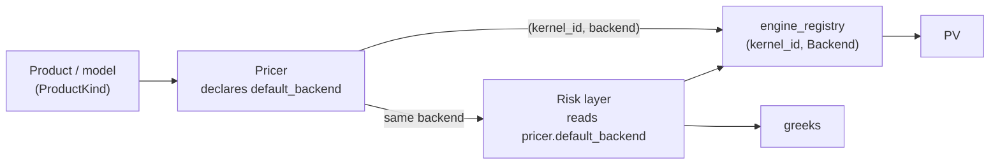

# Engine selection — the backend is determined by the product's model

> Companion to [pricing_architecture.md](pricing_architecture.md) (the contract/market/engine
> layering) and [numba_engine.md](numba_engine.md) (the Numba implementation plan).

This document fixes one policy: **which numeric backend a pricer uses is a property of the
product's pricing model, not a global switch or a per-call whim.** The backend is *bound* by
the pricer; the risk layer dispatches through the *same* backend. That binding is what makes
"greeks reconcile with a reprice" a structural invariant instead of a hope.

---

## 1. Principle

The chain is **product → model → engine**:

- The **product** selects a **pricing model** (a vanilla swap is discounted cashflows; a
  European swaption is Black/Bachelier; a Bermudan is a lattice/PDE/LSM).
- The **model's mathematical structure** selects the **engine**, along two axes:
  - **closed-form vs numerical** — a closed-form price admits analytic first-order
    sensitivities and a cheap finite-difference of that gradient for second order; a numerical
    model needs adjoint AD or a model-specific differentiation.
  - **which greeks are mandatory** — first-order bucketed risk vs exact cross-gamma / vol-cube
    cross-greeks raises or lowers the bar.

That chain usually collapses to the product type, but the precise binding is at the
**(product, model)** level: the *same* instrument can carry more than one model (a swaption
under Black vs Bachelier vs a numerical Bermudan engine), and those pick different backends.

---

## 2. The consistency guarantee (the reason this is a policy, not a preference)

When the pricer binds the engine, a trade's **PV and its entire greek vector are co-generated
by one model**. Risk is then the true sensitivity of the price you actually quoted — by
construction. The anti-pattern this kills is *price with engine A, risk with engine B*, where
the gamma doesn't reconcile against a reprice and the P&L explain falls apart.

A single global engine is wrong for the same reason in reverse: it forces some products into a
backend that mishandles their risk —

- bump-and-reprice on a **kinked payoff** (cap/floor) → unstable, noisy gamma;
- a **Bermudan** in a closed-form engine → simply incorrect;
- **autodiff everywhere** → pays compile latency and shape-specialization tax (see
  [numba_engine.md](numba_engine.md)) on linear products that never needed it.

The engine is *determined*, not *exclusive* — see §5 on validation.

---

## 3. Selection table

| Product / model | Default engine | Risk method | Why |
|---|---|---|---|
| **Linear rates** — swap, FRA, deposit, basis (one-shot price) | `Numpy` | analytic first-order + FD-of-gradient gamma | zero compile; fastest on a single trade |
| **Linear rates** — book / repeated risk | `Numba` | analytic first-order (bucketed delta, index/funding split, calibration Jacobian) + FD-of-gradient gamma | dtype-not-shape compile (one compile, any book), fastest reprice |
| **European optionality** — swaption, cap, floor | `Numba` | closed-form Black/Bachelier greeks (delta/gamma/vega/vanna/volga); bucketed vega via vol-surface chain | analytic greeks are textbook and stable |
| **Bermudan / path-dependent** | numerical engine + `Jax` (or model AAD) | autodiff through the lattice/PDE/MC | no closed form; hand-differentiating a numerical engine is the wrong trade |
| **Validation oracle** (all of the above) | `Jax` | `grad` / `jacobian` / `hessian` | exact AD to cross-check analytic + FD risk in CI |

`Numpy` and `Numba` produce the *same* analytic risk; the split is purely one-shot vs
repeated-book performance. `Jax` is the production engine only for the numerical-model row;
elsewhere it is the validation oracle (§5).

---

## 4. How it binds to the existing seam

Nothing new structurally — this is what `engine_registry` keyed `(kernel_id, Backend)` and the
`ProductKind`/pricer dispatch were built for.

Concretely:

1. The **pricer owns the binding.** A pricer is already product-specific; give it a
   `default_backend` (today `SwapPricer.price(..., backend=...)` is the seam — lift it to a
   declared default the pricer advertises).
2. The **risk layer dispatches through the pricer's backend**, never choosing independently.
   `Sensitivities` / `AutodiffRisk` ask the program/pricer which backend produced the PV and
   risk against *that*, so the two cannot diverge.
3. **Adding a backend for a product is a registry registration**, not a call-site change —
   register `(kernel_id, Backend.Numba)` alongside `(kernel_id, Backend.Numpy)`.

---

## 5. Validation — pinned in production, multi-engine for cross-check

Pinning one engine per product gives consistency; it must **not** ossify into a single
implementation you can't check. The seam stays multi-engine for *validation*:

- The way you **trust** the Numba analytic first-order and FD-gamma is to run the same product
  through the `Jax` Hessian (and bump-and-reprice) in CI and assert agreement to tolerance.
- `CalibrationResult.jacobian` (the exact JAX `∂implied/∂z`) is the oracle for the analytic
  calibration Jacobian.

So: **one engine bound per product in production; all engines reachable behind the seam for
cross-checking.** The engine is determined, not exclusive.

---

## 6. Summary

- Backend is a function of the **product's model**, bound by the **pricer**, consumed by the
  **risk layer** — never chosen globally or ad hoc.
- The payoff is a structural guarantee: **greeks are the sensitivities of the quoted price.**
- Linear + European → analytic risk on `Numba`/`Numpy`; numerical models → AD on `Jax`; `Jax`
  is the validation oracle everywhere else.
