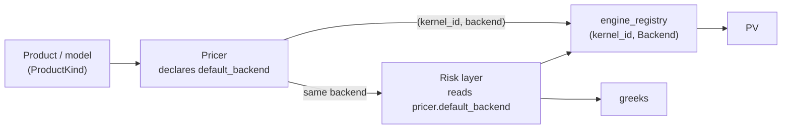

# Engine selection — the backend is determined by the product's model

> Companion to [pricing_architecture.md](pricing_architecture.md) (the contract/market/engine
> layering) and [numba_engine.md](numba_engine.md) (the Numba implementation plan).

This document fixes one policy: **which numeric backend a pricer uses is a property of the
product's pricing model, not a global switch or a per-call whim.** The backend is *bound* by
the pricer; the risk layer dispatches through the *same* backend. That binding is what makes
"greeks reconcile with a reprice" a structural invariant instead of a hope.

---

## 1. Principle

The chain is **product → model → engine**:

- The **product** selects a **pricing model** (a vanilla swap is discounted cashflows; a
  European swaption is Black/Bachelier; a Bermudan is a lattice/PDE/LSM).
- The **model's mathematical structure** selects the **engine**, along two axes:
  - **closed-form vs numerical** — a closed-form price admits analytic first-order
    sensitivities and a cheap finite-difference of that gradient for second order; a numerical
    model needs adjoint AD or a model-specific differentiation.
  - **which greeks are mandatory** — first-order bucketed risk vs exact cross-gamma / vol-cube
    cross-greeks raises or lowers the bar.

That chain usually collapses to the product type, but the precise binding is at the
**(product, model)** level: the *same* instrument can carry more than one model (a swaption
under Black vs Bachelier vs a numerical Bermudan engine), and those pick different backends.

---

## 2. The consistency guarantee (the reason this is a policy, not a preference)

When the pricer binds the engine, a trade's **PV and its entire greek vector are co-generated
by one model**. Risk is then the true sensitivity of the price you actually quoted — by
construction. The anti-pattern this kills is *price with engine A, risk with engine B*, where
the gamma doesn't reconcile against a reprice and the P&L explain falls apart.

A single global engine is wrong for the same reason in reverse: it forces some products into a
backend that mishandles their risk —

- bump-and-reprice on a **kinked payoff** (cap/floor) → unstable, noisy gamma;
- a **Bermudan** in a closed-form engine → simply incorrect;
- **autodiff everywhere** → pays compile latency and shape-specialization tax (see
  [numba_engine.md](numba_engine.md)) on linear products that never needed it.

The engine is *determined*, not *exclusive* — see §5 on validation.

---

## 3. Selection table

| Product / model | Default engine | Risk method | Why |
|---|---|---|---|
| **Linear rates** — swap, FRA, deposit, basis (one-shot price) | `Numpy` | analytic first-order + FD-of-gradient gamma | zero compile; fastest on a single trade |
| **Linear rates** — book / repeated risk | `Numba` | analytic first-order (bucketed delta, index/funding split, calibration Jacobian) + FD-of-gradient gamma | dtype-not-shape compile (one compile, any book), fastest reprice |
| **European optionality** — swaption, cap, floor | `Numba` | closed-form Black/Bachelier greeks (delta/gamma/vega/vanna/volga); bucketed vega via vol-surface chain | analytic greeks are textbook and stable |
| **Bermudan / path-dependent** | numerical engine + `Jax` (or model AAD) | autodiff through the lattice/PDE/MC | no closed form; hand-differentiating a numerical engine is the wrong trade |
| **Validation oracle** (all of the above) | `Jax` | `grad` / `jacobian` / `hessian` | exact AD to cross-check analytic + FD risk in CI |

`Numpy` and `Numba` produce the *same* analytic risk; the split is purely one-shot vs
repeated-book performance. `Jax` is the production engine only for the numerical-model row;
elsewhere it is the validation oracle (§5).

**Shipped defaults vs this table.** Every pricer ships `default_backend = Numpy` — the
always-available reference: numba is an optional dependency, and `NumbaProgram` supports only
`LogLinearDF` curves with static pillar geometry (calibration on `LogCubicDF` / `RateLinear`
must run numpy). The `Numba` rows above are the *recommended production binding* for
repeated-book work, selected explicitly at compile (`backend=Backend.Numba`). Analytic
first-order risk (`SwaptionProgram.risk`, `FuturesProgram.risk`, `NumbaRisk`) always executes
on the Numba adjoint regardless of the reprice backend — numpy has no adjoint implementation —
via the cached `PricingProgram.prepare(market, backend=Backend.Numba)`. The §2 guarantee is a
*model*-level invariant, not an implementation-level one: numpy and numba are two builds of
the same closed forms, held to machine-precision agreement in CI.

`Backend.Rust` is a fourth registered seam (`engines/rust/`, contract documented, no kernel
implemented yet): a PyO3/maturin kernel would register under
the same `(kernel_id, Backend)` key, consuming `KernelInputs` contiguous arrays zero-copy. It
would slot into the same rows as `Numba` when it lands.

---

## 4. How it binds to the existing seam

Nothing new structurally — this is what `engine_registry` keyed `(kernel_id, Backend)` and the
`ProductKind`/pricer dispatch were built for.



Concretely:

1. The **pricer owns the binding.** Every pricer declares `default_backend` (all `Numpy`
   today — see §3), and every `compile` / `price` accepts `backend=None → that default`, one
   idiom across `SwapPricer` / `SwaptionPricer` / `FuturesPricer`.
2. The **risk layer dispatches through the pricer's model**, never choosing independently.
   Bump-and-reprice (`Sensitivities`) runs whatever backend priced; the analytic adjoint is
   Numba-only and reached uniformly through `program.prepare(market, backend=Backend.Numba)` —
   valid because numpy/numba implement the same closed forms (§3 note).
3. **Adding a backend for a product is a registry registration**, not a call-site change —
   register `(kernel_id, Backend.Numba)` alongside `(kernel_id, Backend.Numpy)`.

---

## 5. Validation — pinned in production, multi-engine for cross-check

Pinning one engine per product gives consistency; it must **not** ossify into a single
implementation you can't check. The seam stays multi-engine for *validation*:

- The way you **trust** the Numba analytic first-order and FD-gamma is to run the same product
  through the `Jax` Hessian (and bump-and-reprice) in CI and assert agreement to tolerance.
- `CalibrationResult.jacobian` (the exact JAX `∂implied/∂z`) is the oracle for the analytic
  calibration Jacobian.

So: **one engine bound per product in production; all engines reachable behind the seam for
cross-checking.** The engine is determined, not exclusive.

---

## 6. Summary

- Backend is a function of the **product's model**, bound by the **pricer**, consumed by the
  **risk layer** — never chosen globally or ad hoc.
- The payoff is a structural guarantee: **greeks are the sensitivities of the quoted price.**
- Linear + European → analytic risk on `Numba`/`Numpy`; numerical models → AD on `Jax`; `Jax`
  is the validation oracle everywhere else.

---

## 7. Worked wiring — swaps and swaptions

The policy above, as running code. One market serves both examples: a simple 5-pillar
LogLinearDF curve and two flat vol surfaces — one per quoting convention, because
`VolSurface.units` is enforced against the option's model at lookup. (Outputs are from a
`2026-06-01` run.)

```python
import numpy as np
from finance.dates import Date
from finance.markets.context import MarketContext
from finance.markets.curves import CurveNamespace, YieldCurve
from finance.markets.vols import FlatVolSurface, VolNamespace, VolUnits

as_of  = Date(2026, 6, 1)
origin = as_of.to_numpy()
dates  = np.array([origin + np.timedelta64(d, "D") for d in (0, 365, 3 * 365, 7 * 365, 12 * 365)])
t      = (dates.astype(np.int64) - dates[0].astype(np.int64)) / 365.0
zeros  = np.array([0.0, 0.035, 0.040, 0.045, 0.047])

curves = CurveNamespace()
curves.bind(YieldCurve.build(dates, np.exp(-zeros * t), currency="USD", index_name="SOFR"))
vols = VolNamespace()
vols.bind("USD.SOFR",    FlatVolSurface(0.0095, VolUnits.Normal))     # 95bp normal — Bachelier
vols.bind("USD.SOFR.LN", FlatVolSurface(0.24,   VolUnits.Lognormal))  # 24%  lognormal — Black
market = MarketContext(as_of, curves, vols=vols)
```

### 7.1 Swaps — linear rates, engines interchangeable behind one program

```python
from finance.instruments.resolution import Swap
from finance.pricing.pricers import SwapPricer
from finance.pricing.types import Backend

recv_5y = Swap.fixed_float_swap(notional=100e6, rate_index="SOFR", fixed_rate=0.041, tenor="5Y",  as_of=as_of)
pay_10y = Swap.fixed_float_swap(notional=-25e6, rate_index="SOFR", fixed_rate=0.040, tenor="10Y", as_of=as_of)

# Requests via the Priceable functor — compiled once on first call, repriced thereafter.
# 'pv' / 'leg_pvs' are free (one kernel pass); 'cashflows' is opt-in report assembly.
res = recv_5y(market, requests=["pv"])
res.pv                      # -1,152,667.50   (5Y par ~4.65% >> 4.1% fixed -> recv-fixed underwater)
res.leg_pv                  # [ 18,407,625.51, -19,560,293.02 ]
res.cashflows               # None — not requested

# Book path: same instruments, either engine, same PVs (§3: numpy = reference, numba = opt-in).
program = SwapPricer().compile([recv_5y, pay_10y])                        # Backend.Numpy default
hot     = SwapPricer().compile([recv_5y, pay_10y], backend=Backend.Numba) # explicit hot path
program.price(market).instrument_pv   # [-1,152,667.50, 1,273,777.68]
hot.price(market).instrument_pv       # identical to ~1e-7 absolute (1e-13 relative)
```

### 7.2 Swaptions — same wiring, model picks the kernel *and* the surface

```python
from finance.instruments.resolution import Swaption, SwaptionModel
from finance.pricing.pricers import SwaptionPricer

payer_n = Swaption.european(notional=50e6, strike=0.040, expiry="1Y", swap_tenor="5Y", as_of=as_of,
                            payer=True,  model=SwaptionModel.Bachelier)                       # -> USD.SOFR (Normal)
recv_ln = Swaption.european(notional=50e6, strike=0.040, expiry="1Y", swap_tenor="5Y", as_of=as_of,
                            payer=False, model=SwaptionModel.Black, vol_name="USD.SOFR.LN")   # -> Lognormal

sw_prog = SwaptionPricer().compile([payer_n, recv_ln])   # unit-coupon swap program underneath
r = sw_prog.reprice(market)
r.forward        # [0.04652, 0.04652]      forward par rate, read off leg PVs
r.annuity        # [2.145e8, 2.145e8]      cash annuity x notional
r.volatility     # [0.0095, 0.24]          each option resolved its own surface
r.pv             # [1,696,133.13, 355,715.81]

# Full monetary greeks co-generated by the same closed form (§2's guarantee):
r.greeks.delta   # [ 1.617e8, -4.866e7 ]
r.greeks.vega    # [ 6.761e7,  3.007e6 ]
r.greeks.gamma   # [ 7.117e9,  5.789e9 ]

# Wrong pairing fails loudly — Black model reading the Normal surface:
Swaption.european(..., model=SwaptionModel.Black)   # ValueError: requires a Lognormal vol
                                                    # surface; 'USD.SOFR' is quoted Normal
```

### 7.3 The `RiskEngine` — §4's dispatch as one front door

`RiskEngine(program, market)` resolves the risk *method* from what the program and market
support — `adjoint` (numba + LogLinearDF) or `bump` (universal fallback) — and serves the
same requests either way. Pinning `method="bump"` is the §5 cross-check.

```python
from finance.pricing.risk import RiskEngine

risk = RiskEngine(program, market)
risk.method                 # 'adjoint'  (numba installed, curve is LogLinearDF)

risk.dv01("USD.SOFR")       # [-45,589.44, 19,811.93]   per instrument, +1bp parallel
lad = risk.ladder("USD.SOFR")
lad.pillar_years            # [1.0, 3.0, 7.0, 12.0]
lad.ladder                  # [[  -536.58, -14,990.47, -30,062.39,       0.00],
                            #  [   130.54,     783.84,   6,582.76,  12,314.79]]
lad.dv01                    # == risk.dv01 (key-rate additivity)

RiskEngine(program, market, method="bump").dv01("USD.SOFR")
                            # [-45,589.44, 19,811.93]   central-difference cross-check

risk.gamma("USD.SOFR")      # (4, 4) book pillar Hessian, 0.5*H*bp^2 — FD of the exact
                            # gradient; asking a 'bump' engine for gamma raises (§2)

# Swaptions ride the same front door — the adjoint chains option delta through the
# underlying forward/annuity gradients (sticky-strike):
srisk = RiskEngine(sw_prog, market)
srisk.ladder("USD.SOFR").ladder   # [[-3,564.82,  3,174.07, 16,360.27, 0.00],
                                  #  [ 1,063.76, -1,113.69, -5,096.70, 0.00]]
srisk.dv01("USD.SOFR")            # [15,969.52, -5,146.63]; bump agrees to ~1e-5 relative

# On a RateLinear / LogCubicDF curve the same calls resolve to method='bump' automatically;
# futures are rejected with a pointer to FuturesProgram.risk (their measure is not PV).
```

The wiring demonstrates every §4 rule: the pricer bound the pricing backend (`compile`),
the risk layer derived its method from the program + market rather than choosing ad hoc,
and both methods reconcile because they differentiate the same model.
