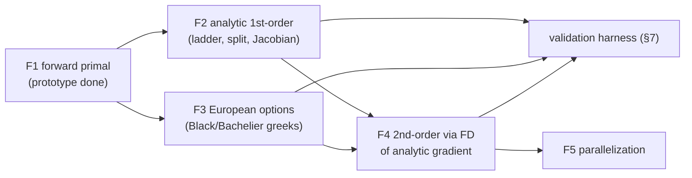

# Numba pricing & analytic-adjoint engine

> Companion to [engine_selection.md](engine_selection.md) (which products bind to this engine)
> and [pricing_architecture.md](pricing_architecture.md) (the columnar `KernelInputs` ABI this
> engine consumes). Production code lives in `finance.pricing.engines.numba`; the research
> scripts now exercise that implementation directly.

The Numba engine is the production fast path for **linear rates** and **European optionality**
(see the [selection table](engine_selection.md#3-selection-table)). It delivers the same risk
outputs the JAX backend produces — key-rate ladder, index/funding split, calibration Jacobian,
per-cashflow deltas, gamma — but via a **hand-written reverse adjoint** (first order) and a
**finite-difference of that analytic gradient** (second order), rather than autodiff.

The work below is decomposed into **independent features** (F1–F6). They can be built
sequentially or in parallel; dependencies are called out per feature.

---

## 0. Why Numba (the properties this engine is built on)

| Property | Consequence |
|---|---|
| **Specialises on dtype, not shape** | One `@njit(float64[::1], …)` compile serves *any* book length — the recompile-per-book / shape-bucketing problem of the JAX backend does not exist. |
| **Lazy first compile, then cache** | The first Numba call builds one dtype/layout signature; later calls of any portfolio length reuse it. |
| **`cache=True` disk cache** | Cold import compiles (~1.5 s), warm import loads from disk (~0.4 s) — robust, content-keyed, no JAX-persistent-cache hygiene caveats. |
| **Native loops / gather / branches** | A natural fit for ragged segment reductions and cap/floor branches — no branchless `where` rewrites. |

**Prototype results** (forward reprice, agreement ~2e-7 with `fastmath`): Numba beats numpy
**3.2–10.9×** and JAX steady-state **1.3–5×**; 200-swap book — numpy 10.5 ms, **Numba 2.5 ms**,
JAX 3.2 ms (+0.6 s per-shape compile). One import-time compile, reused across all shapes.

---

## 1. Architecture

The engine lives at `finance/pricing/engines/numba/`, registered under `Backend.Numba` against
the same `(kernel_id, Backend)` keys as the numpy engine, consuming the same `KernelInputs`. A
small `prepare(program, market)` step lowers the columnar inputs + curve geometry into the flat
`float64[::1]`/`int64[::1]` arguments the `@njit` kernels take (offsets, day-count fractions,
the static obs-date dedup map, flattened curves). All date math is static and gradient-free;
the only varying quantities are the per-curve zero-rate vectors `z`.

Curve discounting runs **inside** nopython mode: `LogLinearDF` (log-linear in `ln DF`) plus
flat-forward extrapolation, via a binary search over the flattened node arrays
(`curve_x`, `curve_logdf`, `curve_node_off`). `RateLinear` is a later addition behind the same
interpolation dispatch.

---

## 2. Feature F1 — Forward primal kernel (linear rates) **[implemented]**

**Goal.** `numba_reprice(...) -> instrument_pv`, the `@njit` twin of `compiler.reprice`:
fixed / single-fixing float / daily-compounded / arithmetic-averaged, with spread, per-fixing
`index_floor`, and final-period `cap`/`floor` + margin treatment. Static obs-date dedup mirrors
numpy's `_project_dedup` (evaluate `DF` once per unique fixing date, gather).

**Status.** `NumbaProgram` implements the fused primal under `engines/numba/program.py` and
returns instrument, leg, flow, and rate outputs. Narrow DCF/rate kernels are also registered
under `Backend.Numba`; historical fixings are constants in the adjoint.

**Validation.** PV vs the numpy engine to ~1e-7 (tighten by dropping `fastmath` on a check
build); cross-check against JAX `JaxProgram.pv`.

---

## 3. Feature F2 — Analytic first-order sensitivities (linear rates) **[implemented]**

This is the role JAX's `grad`/`jacobian` play, done analytically. It produces: the **key-rate
ladder**, the **index/funding split**, **per-cashflow deltas**, and the **calibration
Jacobian**. *Depends on F1.*

### 3.1 The core identity (why it is cheap and sparse)

The curve parameter is `z_p` = continuously-compounded zero at pillar `p`; node
`ln DF = −z_p·t_p`. For `LogLinearDF`, `ln DF(x)` is a convex combination of the **two
bracketing nodes**, with interp weights `w_j(x)` already computed in the discount path. Hence

```
∂ ln DF(x)/∂z_p = −t_p · w_p(x)          # nonzero for only the ≤2 bracketing pillars
∂ DF(x)/∂z_p    =  DF(x) · (−t_p · w_p(x))
```

Every per-flow sensitivity is built from this. The Jacobian rows are **sparse** (2 nonzeros for
discounting, ≤4 for a projection `DF(start)/DF(end)` ratio), so the ladder is one extra
accumulation in the existing loop — *not* dense tangent propagation.

### 3.2 Per-flow, split into index vs funding

`flow_pv = N · rate · τ · DF_disc(pay) · sign`. The product rule splits cleanly:

- **Funding (discount) delta** — through `DF_disc(pay)` only:
  `∂flow_pv/∂z_p^disc = flow_pv · (−t_p · w_p(pay))`.
- **Index (projection) delta** — through `rate` only. For a telescoped OIS coupon
  `cash = N·(DF_s/DF_e − 1)`:
  `∂cash/∂z_p^proj = N·(DF_s/DF_e)·(−t_p)·(w_p(s) − w_p(e))`, then ×`DF_disc(pay)·sign`.

Because the two contributions are accumulated into **separate** buckets, the index/funding
decomposition is automatic — exactly as in the JAX role-split, but analytic.

For the **general** (non-telescoped) compounded/averaged coupon with spread/`index_floor`,
carry tangents through the obs grid: `r_p = expm1(Σ log1p(r_i w_i))/Σ w_i`, differentiate w.r.t.
each obs simple rate `r_i`, and `r_i` w.r.t. its projection `DF`s — one extra pass over the
fixing grid. **Caps/floors/`index_floor`**: the clamp derivative is `0` when binding, `1`
otherwise (a branch; subgradient at the kink, chosen consistently).

### 3.3 The calibration Jacobian `J = ∂implied/∂z`

Same machinery, one row per helper:

- **deposit / FRA**: `implied = (DF(s)/DF(e) − 1)/τ` → differentiate the `DF` ratio.
- **swap par rate**: `implied = −float_pv/fixed_pv` → quotient rule over the analytic leg-PV
  gradients from §3.2.

This replaces `CurveCalibrator.calibrate(..., jacobian=True)`'s JAX path for `Backend.Numba`;
the partial-DV01 transform `(∂V/∂z)·J⁻¹` is unchanged.

### 3.4 Implementation & validation

`NumbaProgram.value_and_grad` accumulates `dPV_dz_disc[p]` and `dPV_dz_proj[p]` per flow
(sparse scatter into ≤2 pillars), then reduces them to instrument ladders. `NumbaRisk`
exposes both roles and per-cashflow matrices. The calibration Jacobian uses this adjoint by
default; `Backend.Jax` remains an explicit validation oracle.

---

## 4. Feature F3 — Vanilla option pricers (European optionality) **[implemented]**

European swaptions, caps, floors under **Black** and **Bachelier**. *Depends on F1 for the
underlying forward/annuity; independent of F2's curve-delta details otherwise.*

- **Primal**: closed-form Black/Bachelier on the par/forward rate and annuity built from the
  curve (`N`, `φ`, `exp`, `sqrt` — all `@njit`-able and stable).
- **Greeks are textbook closed forms** — delta, gamma, **vega**, **vanna** (`∂²V/∂F∂σ`),
  **volga** (`∂²V/∂σ²`) all have analytic expressions. Note vega is a *first-order* derivative
  (w.r.t. `σ`) — mechanically "delta against the vol axis."
- **Bucketed vega across the vol surface** `(expiry × tenor × strike)`: chain the analytic
  `∂V/∂σ` through the surface interpolation — the same local-interpolation sparsity trick as the
  curve delta in §3.1, one more axis.
- **Curve chain**: the forward and annuity depend on the curve, so swaption *delta* chains
  through F2's curve sensitivities — reuse §3.

**Validation.** Greeks vs analytic Black/Bachelier references and vs JAX AD of the same primal.

`FuturesPricer` lowers SR1/SR3 reference periods into one-flow averaged/compounded programs.
`SwaptionPricer` obtains forward and annuity from compiled unit-fixed swaps, then applies the
Numba Black/Bachelier value and greek kernels.

---

## 5. Feature F4 — Approximating second-order derivatives **[implemented]**

The cheap, accurate route to **gamma** (and the option cross-greeks) without hand-rolling any
second derivatives. *Depends on F2 (and F3 for vol cross-greeks).*

### 5.1 Finite-difference the analytic gradient (not the price)

With the exact analytic gradient `g(z) = ∂V/∂z` from F2 (cheap, sparse, one pass):

```
H[:, p] ≈ ( g(z + h·e_p) − g(z − h·e_p) ) / (2h)     # one gradient eval per pillar
H       ← ½ (H + Hᵀ)                                  # enforce symmetry
```

- **Cost**: the full `P×P` gamma from **P gradient evaluations** — `O(P)` analytic passes, vs
  bump-and-reprice's `O(P²)` repricings.
- **Accuracy**: this is *one* layer of finite differencing on an *exact* first derivative
  (central-diff error `O(h²)`), versus second-differencing the price
  `(V₊+V₋−2V₀)/h²`, which suffers catastrophic cancellation (~`√ε` effective precision). With
  `h ~ 1e-5…1e-6` the result is typically within **4–5 nines** of true gamma — well inside the
  "99%" bar, and far better-conditioned than a price-based gamma grid.
- **Even cheaper**: if only diagonal/near-diagonal convexity is needed, truncate to the
  diagonal-dominant band (rate curves are local) — but the full matrix is already `O(P)` here.

### 5.2 Option cross-greeks by the same trick

- **vanna** `∂²V/∂F∂σ` ≈ FD of analytic delta w.r.t. `σ` (or analytic vega w.r.t. `F`).
- **volga** `∂²V/∂σ²` ≈ FD of analytic vega w.r.t. `σ`.

One FD layer on an exact first-order greek — same accuracy/cost argument as §5.1.

`NumbaRisk.gamma` implements the central FD of the exact total gradient and symmetrizes the
result. It preserves historical-fixing masks while varying curve parameters.

### 5.3 Validation

Diff the FD-of-gradient gamma against the **JAX `hessian`** (the exact oracle) and report the
relative error to put a real number on the "99%" claim. This is the headline cross-check that
licenses shipping approximate second-order risk.

---

## 6. Feature F5 — Parallelization **[future]**

`@njit(parallel=True)` + `prange`. *Depends on F1–F4 being stable.*

- **Trivially parallel**: the per-flow discount loop, the per-curve unique-`DF` loop, the
  cash/`flow_pv` computation — independent across `f`.
- **Needs restructuring**: the compounded reduction `g_log[p] += log1p(r·w)` is a scatter-add
  over periods — a write race if parallelized over the raw fixing stream `m`. Parallelize over
  **periods** (outer `prange` over `p`, inner serial over that period's fixings), which means
  carrying per-period fixing offsets rather than the flat `per_obs_period` map. Same care for
  the `inst_pv[flow_instrument[f]] +=` accumulation (per-thread partials / parallel reduction).
- **Gate by size**: thread dispatch loses on small books — keep a serial signature for
  singletons and a parallel one for large books (two signatures, one source).

---

## 7. Cross-engine validation harness

A shared property under [engine_selection.md §5](engine_selection.md#5-validation--pinned-in-production-multi-engine-for-cross-check): every Numba risk output (F2 ladders, F3 greeks, F4 gamma,
calibration Jacobian) is asserted against the `Jax` AD oracle (and bump-and-reprice) in CI to
tolerance. This is what licenses the analytic/approximate risk for production use.

---

## 8. Sequencing



- **F1 → F2 → F4** is the linear-rates critical path (delta → gamma).
- **F3** (options) is independent of F2's internals and can proceed in parallel once F1 lands.
- **F5** (parallelization) is a pure performance follow-up, last.
- **The validation harness (§7)** grows alongside F2–F4 — never after.
