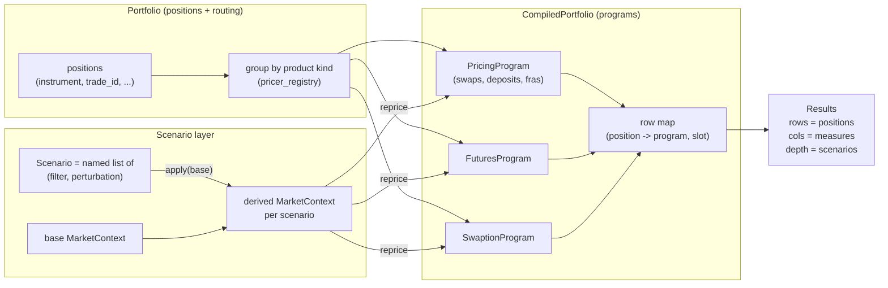

# Portfolio & Scenarios — design

> **Status: DESIGN — nothing in this document is implemented yet.** Companion to
> [pricing_architecture.md](pricing_architecture.md) (which reserves the word "Portfolio" for
> exactly this layer) and [engine_selection.md](engine_selection.md) (backend policy the
> portfolio inherits, never overrides).

The pricing layer stops deliberately at `PricingProgram`: a compiled, repriceable artifact
with no positions, no P&L, no book identity. This document designs what sits on top — a
**Portfolio** that collects heterogeneous instruments and routes them to their pricing
programs, a **Scenario** that collects declarative market shocks (curves + vol surfaces),
the pairing of the two (`portfolio @ scenario`), and the expanded **measure** vocabulary
(PV, accrued, clean PV, the 01s) the pairing reports.

---

## 1. Prior art

### OpenGamma Strata — the closest model

Strata's calculation framework is the strongest precedent, and this design borrows its shape
deliberately (it is the bar this library holds itself to):

- **`CalculationRunner`** computes a grid: *trades as rows, measures as columns*, one cell
  per (trade, measure) — and when scenarios are in play, each cell holds an *array* of
  values, one per scenario ([calculation flow](https://strata.opengamma.io/calculation_flow/),
  [CalculationRunner](https://strata.opengamma.io/apidocs/com/opengamma/strata/calc/CalculationRunner.html)).
- **`CalculationRules`** resolve which pricing function serves each (trade type, measure) —
  the trade doesn't know how to price itself; a registry does. Our `pricer_registry` is the
  same idea, already in place.
- **Measures are a fixed, named vocabulary**
  ([Measures](https://strata.opengamma.io/apidocs/com/opengamma/strata/measure/Measures.html)):
  `PRESENT_VALUE`, `PV01_CALIBRATED_SUM` / `_BUCKETED`, `PV01_MARKET_QUOTE_SUM` / `_BUCKETED`,
  `PAR_RATE`, `PAR_SPREAD`, `ACCRUED_INTEREST`, `LEG_PRESENT_VALUE`, `CASH_FLOWS`,
  `CURRENT_CASH`, `CURRENCY_EXPOSURE`, `VEGA_MARKET_QUOTE_BUCKETED`. Note the *calibrated*
  vs *market-quote* PV01 split — zero-rate-pillar risk vs risk mapped back to the quoted
  instruments through the calibration Jacobian. We already own both halves of that seam
  (`NumbaRisk.unit_zero_jacobian` + `partial_dv01` + `CalibrationResult.jacobian`).
- **Scenarios are declarative data, not mutated markets**
  ([ScenarioDefinition](https://strata.opengamma.io/apidocs/com/opengamma/strata/calc/marketdata/ScenarioDefinition.html)):
  a `ScenarioDefinition` is a list of `PerturbationMapping`s, each pairing a *filter* (which
  market data to hit — e.g. "all USD curves") with a *perturbation* (how — e.g.
  `CurveParallelShifts.absolute(-10bp, 0, +10bp)`). The base market is built once;
  perturbed copies are derived per scenario.

### QuantLib — the counter-model

QuantLib scenarios work by **mutation**: market quotes are `SimpleQuote`s behind relinkable
handles, instruments observe them, and a scenario is "set the quote, let the observer graph
lazily recalculate." It is ergonomic for one trade and hostile to a columnar book: hidden
mutable state, per-instrument recalculation, and no scenario identity (a scenario is a side
effect, not a value you can name, store, or diff). We take Strata's side: **a scenario is
data**. This is also the side our own architecture already chose — `MarketContext` is
immutable, `with_curve` / `rebind` produce derived markets, and `compile once, reprice many`
*is* the runner loop.

---

## 2. The shape of the layer



Three separations, mirroring the pricing layer's own:

1. **Portfolio vs CompiledPortfolio** — collect/route vs compiled artifact, exactly the
   instrument-vs-`PricingProgram` split one level up. Compile once; every scenario is a
   reprice.
2. **Scenario vs MarketContext** — a scenario is a named *description* of shocks; a
   `MarketContext` is materialized from it on demand. The base market is just the identity
   scenario.
3. **Results vs measures** — measures are the vocabulary; `Results` is the container
   (positions × measures × scenarios) with the raw arrays underneath and a `to_pandas()`
   for the trader.

---

## 3. Portfolio

```python
portfolio = Portfolio([
    Position(swap_5y,        trade_id="T1"),
    Position(swap_10y_pay,   trade_id="T2"),
    Position(sr3_z26,        trade_id="F1"),
    Position(payer_swaption, trade_id="O1"),
])

compiled = portfolio.compile(market)                 # backend per engine_selection.md defaults
compiled = portfolio.compile(market, backend=Backend.Numba)   # explicit hot path
```

- **Routing.** `Portfolio.compile` buckets positions by product kind and dispatches each
  bucket through `pricer_registry` — swaps/deposits/FRAs into one `PricingProgram`, futures
  into a `FuturesProgram`, swaptions into a `SwaptionProgram`. One compile per product
  group, not per position. A `CompiledPortfolio` keeps the row map back to the original
  position order so results always come back in book order.
- **Positions add identity, never pricing semantics.** Notional already carries size and
  direction on the instrument (that decision is settled). A `Position` wraps an instrument
  with book metadata only: `trade_id`, and later book/desk/counterparty aggregation keys.
  No quantity multiplier — two lots of the same trade are two positions or a bigger
  notional, not a scaling factor the pricing layer has to know about.
- **Backend policy is inherited.** The portfolio passes `backend` through to each pricer and
  otherwise takes the pricer's `default_backend` — it never chooses per product itself
  (that is [engine_selection.md](engine_selection.md)'s job).

---

## 4. Scenario

A **Scenario is a named, immutable list of (filter, perturbation) pairs** over a base
market. It collects exactly two kinds of market data — curves and vol surfaces — because
that is what `MarketContext` holds.

```python
base      = Scenario.base()                                   # identity
rates_up  = Scenario("rates+25bp",  {"USD.SOFR": parallel_zero(+25e-4)})
steepener = Scenario("2s10s+10bp",  {"USD.SOFR": key_rate({"2Y": -5e-4, "10Y": +5e-4})})
vol_up    = Scenario("vega+1bp",    {"USD.SOFR": vol_shift(+1e-4)})       # normal-vol surface
combo     = rates_up | vol_up                                  # union, name auto-joined

ladder    = ScenarioSet.ladder("USD.SOFR", steps_bp=(-50, -25, 0, +25, +50))
# -> named scenarios "USD.SOFR-50bp", ..., "USD.SOFR+0bp", ..., auto-generated
```

- **Filters** select market data by name — exact (`"USD.SOFR"`) or pattern (`"USD.*"`),
  Strata's `MarketDataFilter` reduced to what our namespaces need. Curve names and vol
  surface names live in different namespaces, so a filter is (kind, pattern).
- **Perturbations** are small closed vocabulary to start: `parallel_zero(bp)` (parallel
  shift of zero rates — what `bumped_curve` does today), `key_rate(pillar -> bp)` (what
  the KRD layer does today), `vol_shift(bp)` (absolute, in the surface's own `VolUnits`;
  a relative variant for lognormal surfaces). Custom perturbations are just callables
  `Curve -> Curve` / `VolSurface -> VolSurface` registered with a name — the escape hatch.
- **Application is lazy**: `scenario.apply(base_market) -> MarketContext`, built from the
  existing immutable machinery (`with_curve`, `VolNamespace.rebind` on a copy). Nothing is
  cached until a portfolio asks.

### Declarative up front vs hand-shocked markets — resolved

The open question ("do we define scenarios up front, or shock the market data ourselves?")
has a technical answer, not just a taste answer: **declarative wins because of the prepared
program.** The perturbations above are *geometry-preserving by construction* — they move
values at existing pillars, never add/remove pillars or change the origin. That means every
scenario in a set reprices through the **same cached `NumbaProgram`**
(`params_from_market` revalidates geometry per call), so a 50-scenario ladder over a
10,000-swap book is 50 array passes over one compiled/prepared artifact. A hand-shocked
`MarketContext` can silently carry different pillar dates and invalidate the prepared
program (it fails loudly, but it fails). So:

- **Scenarios are definitions** (filter + perturbation), materialized to markets at run
  time. This is the recommended and documented path.
- **`portfolio @ market` still works** as the escape hatch — pricing against an arbitrary
  hand-built `MarketContext` is just the base-scenario case with a different base. It
  reprices fine on numpy; it only forfeits the shared-prepared-program guarantee.

---

## 5. Measures

The measure vocabulary, with the minimum first slice marked. Like Strata, support is
per-(measure, product) and explicit — an unsupported cell is a *reported* absence
(`Results` carries value-or-reason per cell, Strata-style), never a silent NaN.

| Measure | Swap | Future | Swaption | Source |
|---|---|---|---|---|
| `PV` ★ | ✓ | ✓ (price + VM P&L) | ✓ | `reprice` — exists |
| `LEG_PV` | ✓ | — | forward/annuity | `leg_pv` — exists |
| `ACCRUED` ★ | ✓ | — | — | new kernel column (below) |
| `CLEAN_PV` ★ | ✓ | — | — | `PV − ACCRUED` |
| `PAR_RATE` | ✓ | model rate | forward | `SwapHelper.implied` path — exists |
| `DV01` ★ | ✓ | ✓ | ✓ | `RiskEngine.dv01` (adjoint or bump) — exists |
| `KEY_RATE_01` ★ | ✓ | ✓ | ✓ | `RiskEngine.ladder` (adjoint or bump) — exists |
| `MARKET_QUOTE_01` | ✓ | ✓ | ✓ | `partial_dv01` ∘ `CalibrationResult.jacobian` — exists |
| `GAMMA` | ✓ | ✓ | ✓ | FD-of-gradient (`NumbaRisk.gamma`) — exists |
| `VEGA` / option greeks | — | — | ✓ | monetary `OptionGreeks` — exists |
| `CASH_FLOWS` | ✓ | — | — | `CashflowReport` — exists |
| `CURRENT_CASH` | ✓ | ✓ | — | pay-date == as-of filter over flows |

★ = the minimum slice: **PV, accrued, clean PV, and the 01s**.

Almost everything is plumbing over machinery that already exists; the one genuinely new
computation is **accrued**:

- **Fixed legs:** `notional × fixed_rate × frac(period_start → as_of)` for the on-cycle
  period — a per-flow accrual-to-date column derived from the schedule, zero new market
  data.
- **Compounded (OIS) legs:** accrued is the *realized* compounded coupon from period start
  to as-of — which is exactly the historical-fixings overlay the engines already apply to
  seasoned trades. The observation grid, weights, and fixing values are all in place; the
  measure reads the partial-period reduction instead of the full one.
- `CLEAN_PV = PV − ACCRUED` then falls out, and matches the standard swap decomposition
  (Strata's `ACCRUED_INTEREST` + clean/dirty bond quoting).

This does mean `KernelResult` (or a sibling report) grows — that is the intended "expanding
the scope of reporting results," and it stays columnar: one accrued value per flow, reduced
to legs/instruments with the same `reduceat` machinery as PV.

---

## 6. `portfolio @ scenario`

`__matmul__` reads as "evaluate at" and is worth its three lines of sugar — but it is
*only* sugar over the explicit form, which always exists:

```python
results = compiled.calculate(measures=[PV, ACCRUED, CLEAN_PV, DV01], scenarios=ladder)

results = compiled @ base                # default measure set, one scenario
results = compiled @ ladder              # default measures × 5 scenarios
results = compiled @ (rates_up | vol_up) # composed scenario

results.to_pandas()                      # rows=positions, cols=measures (scenario-major)
results["T2", DV01]                      # one cell; array-valued under a ScenarioSet
results.pnl(base)                        # PV diff vs the base scenario, per position
```

- `@` against a `Scenario` returns single-valued cells; against a `ScenarioSet`,
  array-valued cells (Strata's `ScenarioArray`). Against a raw `MarketContext`, it treats
  it as an anonymous base scenario (the escape hatch from §4).
- The default measure set lives on the portfolio (`Portfolio(positions, measures=...)`),
  so `@` stays argument-free.
- `results.pnl(base)` is the scenario-P&L convenience the ladder exists for: reprice minus
  base, per position, per scenario — the trader-facing artifact.

---

## 7. Phasing

1. **Phase 1 — routing + PV.** `Portfolio` / `Position` / `CompiledPortfolio`, routing via
   `pricer_registry`, measures `PV` / `LEG_PV` / `CASH_FLOWS`, `Scenario` with
   `parallel_zero` + `key_rate`, `ScenarioSet.ladder`, `@`, `Results.to_pandas()` /
   `.pnl()`. Everything reuses existing machinery; no kernel changes.
2. **Phase 2 — the 01s and accrued.** `DV01` / `KEY_RATE_01` through the Numba adjoint,
   `GAMMA` through `NumbaRisk`, the accrued-to-date column and `ACCRUED` / `CLEAN_PV`,
   `PAR_RATE`.
3. **Phase 3 — the full grid.** `vol_shift` scenarios + `VEGA`, `MARKET_QUOTE_01` through
   the calibration Jacobian, value-or-reason cells, report formatting.

Open questions (deliberately deferred):

- **Netting/aggregation keys** on `Position` (book, desk, counterparty) and group-by in
  `Results` — wanted, but nothing in phases 1–3 depends on the answer.
- **Reporting currency.** Single-currency today; Strata's `CURRENCY_EXPOSURE` /
  reporting-currency conversion becomes relevant only with a second currency and FX curves.
- **Scenario composition semantics** beyond union (`|`) — e.g. scaling a scenario, or
  cross grids (rates ladder × vol ladder) for cross-gamma surfaces.
- **Whether `Results` cells for `CASH_FLOWS`-like structured measures** stay objects or get
  their own long-format table (Strata keeps them structured; a long table is more
  pandas-friendly).
