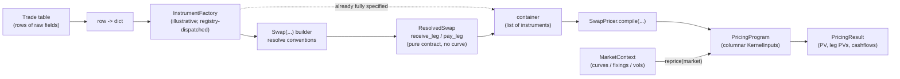
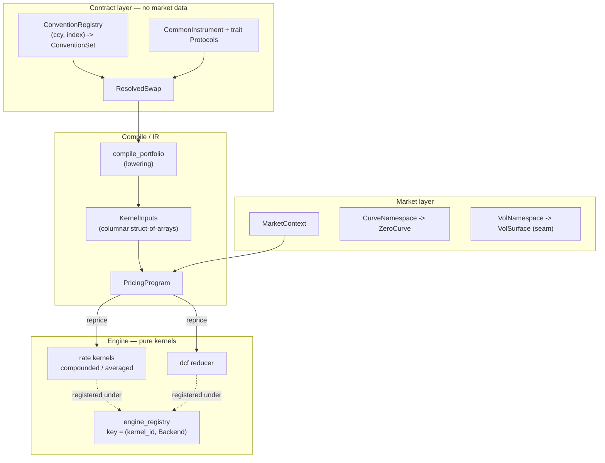
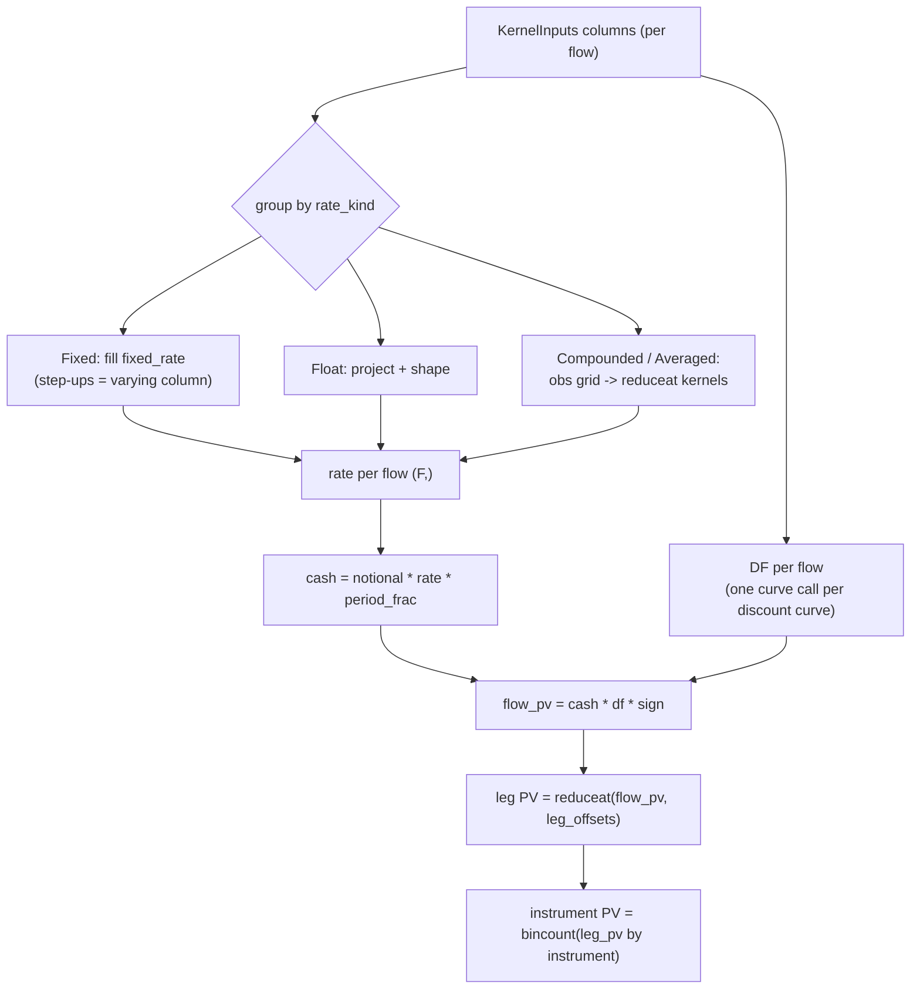
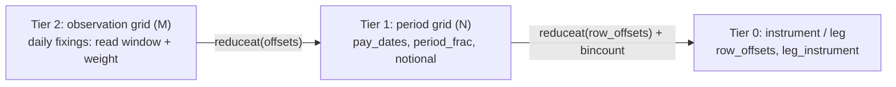

# Pricing Architecture

How a raw trade record becomes a price — from a row of data, through an instrument, into a
compiled `PricingProgram`, repriced against market data. This document lays out the flow,
the design decisions, and the patterns in play.

---

## 1. Design philosophy

Three separations drive every decision here. They are best understood against the
anti-pattern they replace: a single stateful object that took the **curve in its
constructor** and carried `PV`/`KRD`/`accrued` methods plus cached DataFrames. That fusion
forced a full instrument **rebuild per shocked curve** (catastrophic for scenario
analytics) and made every concern entangled.

1. **Contract vs Market vs Analytics.**
   An *instrument* is a contract — what was traded. It holds **no curve**. A `MarketContext`
   holds the market data. A *pricer* combines the two. Because they are separate, the same
   trade reprices against any number of curves with zero rebuilds.

2. **Pure / impure split = a language-agnostic ABI.**
   The *pricer* is impure (resolves curves, looks up conventions, packs arrays). The
   *engine kernels* are pure: contiguous numpy arrays in, arrays out. The boundary
   (`KernelInputs`) is just arrays + offset maps, so a numpy kernel and a future numba/rust
   kernel are interchangeable behind one registry key.

3. **Compile once, reprice many.**
   Instruments are *compiled* into a `PricingProgram` (columnar `KernelInputs`) one time.
   A scenario or curve bump is a single `reprice(market)` over the same arrays — never a
   rebuild. Sensitivities (DV01 / key-rate) are a separate layer that bump-and-reprices this
   program.

---

## 2. End-to-end flow

From a table of trades to a price. The `Factory` is illustrative — any mapping from a raw
record to an instrument; in practice the `Swap(...)` builder *is* a convention-resolving
factory.



Reading it:
- **Row -> dict -> Factory -> Instrument.** A trade record is just data. A factory turns one
  record into an instrument. For a swap, the `Swap(...)` builder resolves market conventions
  from `(currency, index)` so the trader supplies ~4 fields, not ~25.
- **Resolve, or push to a container.** A `ResolvedSwap` is a pure-data contract. Many of
  them collect into a plain container (a list — *not* a "Portfolio"; that word is reserved).
- **Compile -> PricingProgram.** `SwapPricer.compile` lowers the instruments into one
  columnar `KernelInputs` and wraps it as a `PricingProgram`.
- **Reprice with market.** `PricingProgram.reprice(market)` is the cheap, repeatable step.

---

## 3. Layered architecture



Dependencies point downward only: the contract layer knows nothing about markets or engines.

---

## 4. Inside `reprice` — kind-grouping and `reduceat`

The compiled form is **per-flow columns** (one row per accrual period across every leg of
every instrument). The hot path groups flows by `rate_kind` so the work is a handful of
vectorized kernel calls regardless of population size (1 instrument or 10,000 take the same
path).



### The three-tier grid (why ragged coupons don't loop in Python)

Compounded/averaged coupons are *ragged*: N accrual periods, each holding a different number
of daily fixings. Instead of a Python loop per period, the fixings are flattened into one
array with an offset map, and the per-period reduction is `np.add.reduceat`.



Across a portfolio, every SOFR instrument shares the same daily fixing dates, so the rate
lookup is **deduped** (`np.unique(..., return_inverse=True)`): the curve is evaluated once
per unique calendar date, then scattered back via the inverse indices.

---

## 5. Patterns in use

| Pattern | Where | Why |
|---|---|---|
| **Registry + Factory** | `common/registry.py`; `engine_registry` keyed `(kernel_id, Backend)`; `ConventionRegistry` keyed `(ccy, index)` | Pluggable dispatch; add a numba/rust kernel or a new convention without touching call sites. |
| **Protocol traits / structural typing** | `instruments/interfaces/` (`HasFixedRate`, `Bond`, `Swap`, …) | Compose products from capabilities without inheritance; `ResolvedSwap` satisfies `Swap` structurally. |
| **Lowering (source → IR → kernel)** | `compile_portfolio` lowers `CouponSchedule` → columns | One authored source of truth (`CouponEvent`); the columnar form is *derived*, never hand-authored — so no `RateSpec`-vs-event duplication. |
| **Struct-of-arrays (columnar)** | `KernelInputs` | Cache-friendly, vectorizable, and exactly what a numba/rust kernel consumes. Makes piecewise coupons free (a switch is just a varying column). |
| **Compile-once / reprice-many** | `PricingProgram.reprice` | A scenario/bump is one array pass, not a rebuild. |
| **Flatten-and-reduce** | rate kernels + dcf reducer | Ragged per-fixing work becomes segmented `reduceat`; no per-flow Python. |
| **Sentinel encoding** | `cap=+inf`, `floor/index_floor=-inf`, `proj_curve=-1` | Branchless shaping; a genuine `0.0` bound is distinct from "no bound" (`None`). |
| **Convention resolution** | `Swap(...)` + `ConventionRegistry` | Trader fills ~4 fields; `(currency, index)` does the rest. |
| **Versioned namespace** | `CurveNamespace` / `VolNamespace` | Rebind a curve per scenario; version counter for cache invalidation without observers. |

---

## 6. Key design decisions

- **The instrument owns no curve.** This single decision is what enables compile-once and
  kills the per-scenario rebuild. Market data flows in at `reprice`, not construction.
- **Pricing concepts stay simple.** `PricingResult` is PV + leg PVs + cashflows. No
  `accrued`/`KRD`/`NII` methods bolted on. Sensitivities are a separate layer over
  `PricingProgram`.
- **`PricingProgram`, not `Portfolio`.** It has no positions or P&L; it is a compiled,
  repriceable artifact. A real book/portfolio abstraction would sit on top.
- **Enums over strings.** `BDC`, `DayCountMethod`, `Frequency`, `Roll`, `CouponType`
  (with `.is_floating` / `.needs_observation_grid`) — typos are import-time, not runtime.
- **Piecewise coupons are first-class.** Fixed → float → fixed, arbitrary step-ups: the
  per-flow `rate_kind`/`fixed_rate` columns express any switching with no special machinery.
- **Cap/floor on the final period coupon** (documented convention), with `index_floor` as the
  separate per-fixing floor that changes the compounding.
- **Lookback styles are explicit.** ISDA `Lookback` (default; rate at shifted date, real
  weight) vs `ObservationShift` (rate and weight from the shifted window); `lockout` and
  `payment_delay` stay orthogonal.

---

## 7. Extension points

- **Backends.** Register `(kernel_id, Backend.Numba)` / `Backend.Rust` kernels with the same
  `KernelInputs`/`KernelResult` contract — no pricer changes.
- **Options / vols.** `VolNamespace` + `VolSurface` are designed seams; an option model
  (Black/Bachelier) registers alongside the rate kernels.
- **Sensitivities.** A `KeyRateDuration` layer takes a `PricingProgram` + curve and
  bump-reprices — the clean replacement for the legacy rebuild-per-pillar KRD.
- **Dynamic notionals.** `RateDependentNotional` is a designed seam for amortizing / MSR
  exposures (time-step across periods, vectorized across the population).
- **Portfolio / book.** A real aggregation layer (positions, netting, book-level risk) sits
  on top of `PricingProgram`.

---

## 8. Minimal example

```python
from finance.dates import Date
from finance.instruments.resolution import Swap
from finance.pricing.pricers import SwapPricer

# 1. contract — minimal trader input; conventions resolved from (USD, SOFR)
swap = Swap(notional=100, rate_index="SOFR", fixed_rate=0.045, tenor="10Y", as_of=Date(2026, 6, 1))

# 2. compile once -> a PricingProgram
program = SwapPricer().compile([swap])

# 3. reprice against any market (curve bumps / scenarios reuse the same program)
result = program.price(market)
print(result.pv, result.leg_pv)
```
