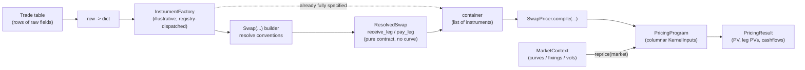
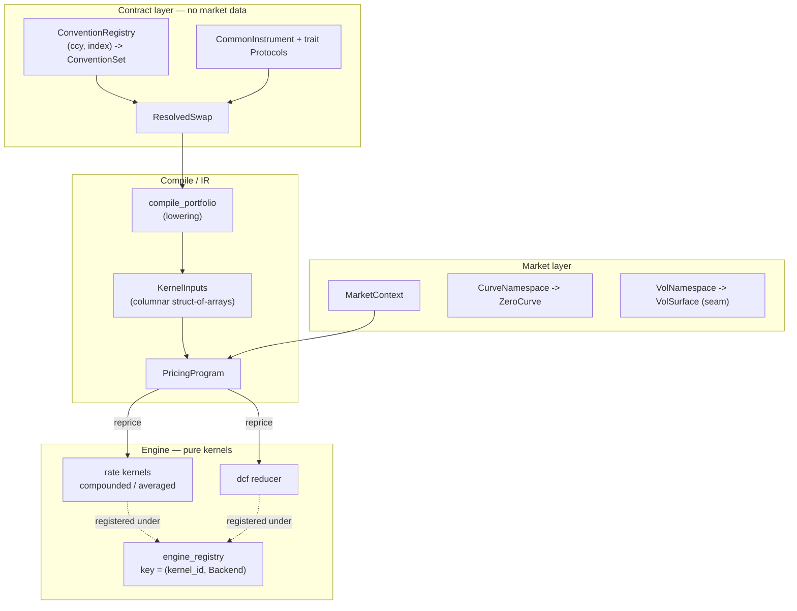
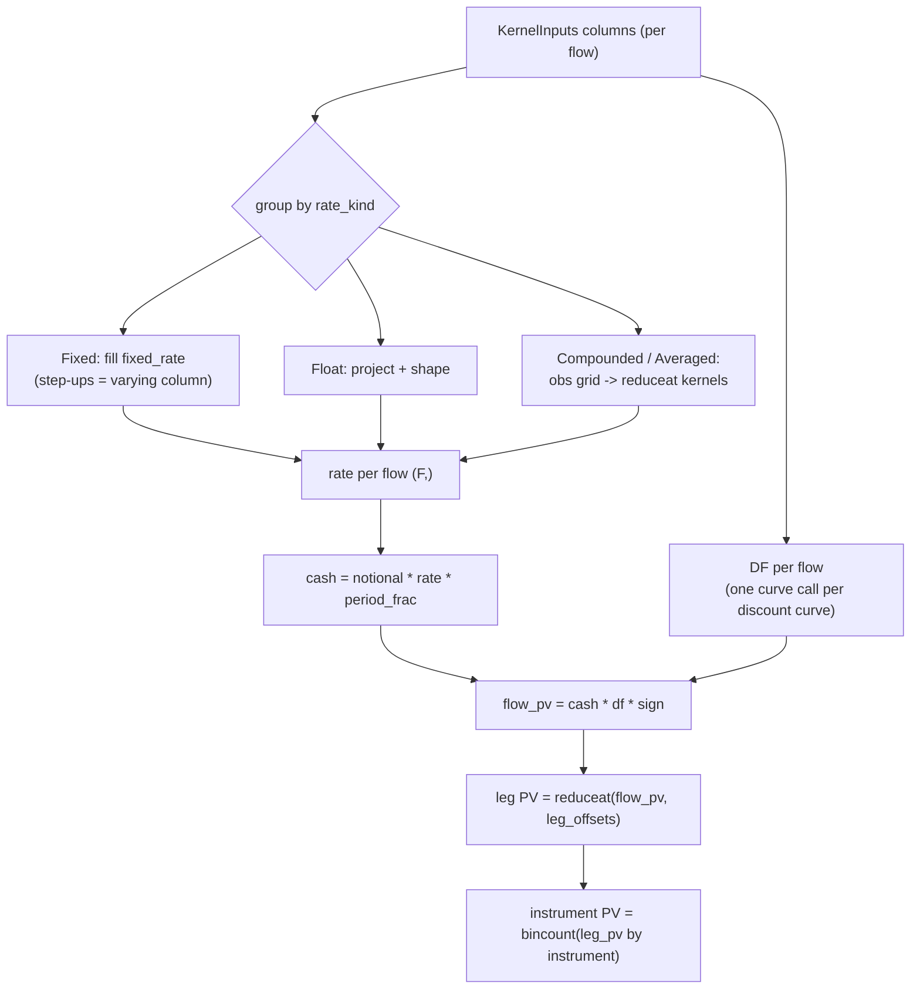
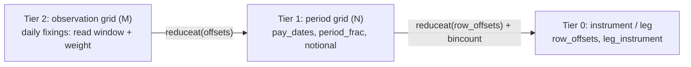

# Pricing Architecture

How a raw trade record becomes a price — from a row of data, through an instrument, into a
compiled `PricingProgram`, repriced against market data. This document lays out the flow,
the design decisions, and the patterns in play.

---

## 1. Design philosophy

Three separations drive every decision here. They are best understood against the
anti-pattern they replace: a single stateful object that took the **curve in its
constructor** and carried `PV`/`KRD`/`accrued` methods plus cached DataFrames. That fusion
forced a full instrument **rebuild per shocked curve** (catastrophic for scenario
analytics) and made every concern entangled.

1. **Contract vs Market vs Analytics.**
   An *instrument* is a contract — what was traded. It holds **no curve**. A `MarketContext`
   holds the market data. A *pricer* combines the two. Because they are separate, the same
   trade reprices against any number of curves with zero rebuilds.

2. **Pure / impure split = a language-agnostic ABI.**
   The *pricer* is impure (resolves curves, looks up conventions, packs arrays). The
   *engine kernels* are pure: contiguous numpy arrays in, arrays out. The boundary
   (`KernelInputs`) is just arrays + offset maps, so a numpy kernel and a future numba/rust
   kernel are interchangeable behind one registry key.

3. **Compile once, reprice many.**
   Instruments are *compiled* into a `PricingProgram` (columnar `KernelInputs`) one time.
   A scenario or curve bump is a single `reprice(market)` over the same arrays — never a
   rebuild. Sensitivities (DV01 / key-rate) are a separate layer that bump-and-reprices this
   program.

---

## 2. End-to-end flow

From a table of trades to a price. The `Factory` is illustrative — any mapping from a raw
record to an instrument; in practice the `Swap(...)` builder *is* a convention-resolving
factory.



Reading it:
- **Row -> dict -> Factory -> Instrument.** A trade record is just data. A factory turns one
  record into an instrument. For a swap, the `Swap(...)` builder resolves market conventions
  from `(currency, index)` so the trader supplies ~4 fields, not ~25.
- **Resolve, or push to a container.** A `ResolvedSwap` is a pure-data contract. Many of
  them collect into a plain container (a list — *not* a "Portfolio"; that word is reserved).
- **Compile -> PricingProgram.** `SwapPricer.compile` lowers the instruments into one
  columnar `KernelInputs` and wraps it as a `PricingProgram`.
- **Reprice with market.** `PricingProgram.reprice(market)` is the cheap, repeatable step.

---

## 3. Layered architecture



Dependencies point downward only: the contract layer knows nothing about markets or engines.

---

## 4. Inside `reprice` — kind-grouping and `reduceat`

The compiled form is **per-flow columns** (one row per accrual period across every leg of
every instrument). The hot path groups flows by `rate_kind` so the work is a handful of
vectorized kernel calls regardless of population size (1 instrument or 10,000 take the same
path).



### The three-tier grid (why ragged coupons don't loop in Python)

Compounded/averaged coupons are *ragged*: N accrual periods, each holding a different number
of daily fixings. Instead of a Python loop per period, the fixings are flattened into one
array with an offset map, and the per-period reduction is `np.add.reduceat`.



Across a portfolio, every SOFR instrument shares the same daily fixing dates, so the rate
lookup is **deduped** (`np.unique(..., return_inverse=True)`): the curve is evaluated once
per unique calendar date, then scattered back via the inverse indices.

---

## 5. Patterns in use

| Pattern | Where | Why |
|---|---|---|
| **Registry + Factory** | `common/registry.py`; `engine_registry` keyed `(kernel_id, Backend)`; `ConventionRegistry` keyed `(ccy, index)` | Pluggable dispatch; add a numba/rust kernel or a new convention without touching call sites. |
| **Protocol traits / structural typing** | `instruments/interfaces/` (`HasFixedRate`, `Bond`, `Swap`, …) | Compose products from capabilities without inheritance; `ResolvedSwap` satisfies `Swap` structurally. |
| **Lowering (source → IR → kernel)** | `compile_portfolio` lowers `CouponSchedule` → columns | One authored source of truth (`CouponEvent`); the columnar form is *derived*, never hand-authored — so no `RateSpec`-vs-event duplication. |
| **Struct-of-arrays (columnar)** | `KernelInputs` | Cache-friendly, vectorizable, and exactly what a numba/rust kernel consumes. Makes piecewise coupons free (a switch is just a varying column). |
| **Compile-once / reprice-many** | `PricingProgram.reprice` | A scenario/bump is one array pass, not a rebuild. |
| **Flatten-and-reduce** | rate kernels + dcf reducer | Ragged per-fixing work becomes segmented `reduceat`; no per-flow Python. |
| **Sentinel encoding** | `cap=+inf`, `floor/index_floor=-inf`, `proj_curve=-1` | Branchless shaping; a genuine `0.0` bound is distinct from "no bound" (`None`). |
| **Convention resolution** | `Swap(...)` + `ConventionRegistry` | Trader fills ~4 fields; `(currency, index)` does the rest. |
| **Versioned namespace** | `CurveNamespace` / `VolNamespace` | Rebind a curve per scenario; version counter for cache invalidation without observers. |

---

## 6. Key design decisions

- **The instrument owns no curve.** This single decision is what enables compile-once and
  kills the per-scenario rebuild. Market data flows in at `reprice`, not construction.
- **Pricing concepts stay simple.** `PricingResult` is PV + leg PVs + cashflows. No
  `accrued`/`KRD`/`NII` methods bolted on. Sensitivities are a separate layer over
  `PricingProgram`.
- **`PricingProgram`, not `Portfolio`.** It has no positions or P&L; it is a compiled,
  repriceable artifact. A real book/portfolio abstraction would sit on top.
- **Enums over strings.** `BDC`, `DayCountMethod`, `Frequency`, `Roll`, `CouponType`
  (with `.is_floating` / `.needs_observation_grid`) — typos are import-time, not runtime.
- **Piecewise coupons are first-class.** Fixed → float → fixed, arbitrary step-ups: the
  per-flow `rate_kind`/`fixed_rate` columns express any switching with no special machinery.
- **Cap/floor on the final period coupon** (documented convention), with `index_floor` as the
  separate per-fixing floor that changes the compounding.
- **Lookback styles are explicit.** ISDA `Lookback` (default; rate at shifted date, real
  weight) vs `ObservationShift` (rate and weight from the shifted window); `lockout` and
  `payment_delay` stay orthogonal.

---

## 7. Extension points

- **Backends.** Register `(kernel_id, Backend.Numba)` / `Backend.Rust` kernels with the same
  `KernelInputs`/`KernelResult` contract — no pricer changes.
- **Options / vols.** `VolNamespace` + `VolSurface` are designed seams; an option model
  (Black/Bachelier) registers alongside the rate kernels.
- **Sensitivities.** A `KeyRateDuration` layer takes a `PricingProgram` + curve and
  bump-reprices — the clean replacement for the legacy rebuild-per-pillar KRD.
- **Dynamic notionals.** `RateDependentNotional` is a designed seam for amortizing / MSR
  exposures (time-step across periods, vectorized across the population).
- **Portfolio / book.** A real aggregation layer (positions, netting, book-level risk) sits
  on top of `PricingProgram`.

---

## 8. Calibration layer

`finance.pricing.calibration` builds market curves from quotes. It wires three things — a
list of **calibration instruments**, a **solver**, and a **target curve definition** — into
one residual closure and hands it to the solver. Output is a calibrated `ZeroCurve` bound
into a *fresh* `MarketContext` (via `MarketContext.with_curve`, the same rebind primitive
sensitivities use); the input market is never mutated.

- **Instruments are single-quote pricers.** A `CalibrationInstrument` exposes one `quote`
  and `implied(market)` — the model value of *that same measure*. The **residual measure
  lives on the instrument**, not the calibrator: `SwapHelper` → par rate, `DepositHelper` /
  `FraHelper` → simple money-market rate, and a future bond helper → yield, all slotting into
  the same calibrator unchanged. Deposits/FRAs are closed-form (`MarketContext.project`);
  swaps compile once and reprice, reading par off the leg PVs by **iterating** the
  instrument's legs (fixed vs floating), never by positional index.
- **Residuals are quote-space, not PV.** `PV = 0` is the underlying concept (a par swap is
  worth zero), but the number handed to the solver is in **rate units** (`implied − quote`).
  This is the production norm (QuantLib `RateHelper::impliedQuote`, Strata par quotes): PV
  residuals scale with annuity × tenor and over-weight the long end, whereas rate residuals
  are ~O(1bp) across the curve → a well-conditioned Jacobian. The reprice still computes PVs
  internally; they are just the intermediate. *Which* PV is zero depends on the discount
  (funding) measure — see `funding_id` below.
- **Two solvers behind one `Solver` protocol.** `GlobalSolver` solves all nodes at once
  (scipy `least_squares`, finite-difference Jacobian = bump-and-reprice) and works for any
  interpolation. `Bootstrapper` solves pillar-by-pillar (`brentq`) and is valid only for
  *local* interpolators (`LogLinearDF` / `RateLinear`); the calibrator rejects a global
  interpolator up front. Parameterisation is continuously-compounded zero rates at the
  pillars (`DF = exp(-x·t)`), with the origin node pinned at `DF = 1`.
- **Proj/disc split via `funding_id`.** A trade carries a **rate index** (projection curve)
  and a **funding id** (discount curve, default `STDCSA`). `STDCSA` aliases per-currency to
  the OIS curve (USD→SOFR, EUR→ESTR); the pricer resolves both at compile time. For a SOFR
  OIS the two coincide, so single-curve calibration is unchanged — but discount and forecast
  are now expressed separately, so a basis curve (e.g. Fed Funds projected, SOFR discounted)
  is just different labels rather than a structural change.
- **Bond / treasury-yield seam.** Quoting on yield (or price) is a new `QuoteKind` plus a
  helper whose `implied` returns that measure — no calibrator change, because the measure is
  the instrument's responsibility.

---

## 9. Worked example: quotes → curve → market → pricer → metrics

End to end: build instruments, calibrate a curve from a quote strip, bind it into a market,
price against it, and pull metrics. (Outputs shown are from a `2026-06-01` run.)

### 9.1 Instruments — soft and hard layer

The **soft layer** is the trader-facing builder: minimal input, conventions resolve the
rest. The same three builders cover the swap and both money-market instruments.

```python
from finance.dates import Date
from finance.instruments.resolution import Swap, Deposit, Fra

as_of = Date(2026, 6, 1)

swap = Swap(notional=100e6, rate_index="SOFR", fixed_rate=0.041, tenor="5Y", as_of=as_of)
depo = Deposit(rate=0.0432, tenor="3M", as_of=as_of)          # spot-start cash deposit
fra  = Fra(rate=0.0440, start="6M", end="12M", as_of=as_of)   # 6x12 FRA

# sign rides on the notional — positive = receive fixed, negative = pay fixed
# swap legs -> ['Fixed', 'GeometricAveraged']  (fixed vs compounded-SOFR);  funding_id 'STDCSA'
```

The **hard layer** is the resolved contract underneath: pure, fully-specified data with no
curve attached. A `ResolvedSwap` is *iterable over its legs*, and each leg is a
`CommonInstrument` you can inspect:

```python
recv, pay = list(swap)                 # ResolvedSwap iterates (receive_leg, pay_leg)
recv.coupon_type.name                  # 'Fixed'
recv.payment_frequency.name            # 'Annually'
recv.day_count_method.name             # 'Actual360'

# negative notional flips orientation: receive leg becomes the floating leg
recv_of_pay_fixed = list(Swap(notional=-50e6, rate_index="SOFR", fixed_rate=0.041,
                              tenor="5Y", as_of=as_of))[0]
recv_of_pay_fixed.coupon_type.name     # 'GeometricAveraged'
```

`Swap(..., **overrides)` is the escape hatch for a non-standard trade (any
`CommonInstrument` field the builder doesn't already set — e.g. `cap`, `index_floor`,
`payment_delay`). `funding_id` (default `STDCSA`) selects the discount curve independently of
the `rate_index` projection curve.

### 9.2 Calibrating a curve

A `CurveCalibrator` takes single-quote helpers, a solver, and a target definition, and
solves for the curve that reprices every quote.

```python
from finance.markets.context import MarketContext
from finance.markets.curves import CurveNamespace, CurveInterpolator
from finance.instruments.resolution import curve_name
from finance.pricing.calibration import (
    CurveCalibrator, CurveDefinition, GlobalSolver,
    deposit_helper, fra_helper, swap_helper,
)

helpers = [
    deposit_helper(rate=0.0430, tenor="1M", as_of=as_of),
    deposit_helper(rate=0.0432, tenor="3M", as_of=as_of),
    deposit_helper(rate=0.0435, tenor="6M", as_of=as_of),
    fra_helper(rate=0.0440, start="6M", end="12M", as_of=as_of),
    swap_helper(rate=0.0420, tenor="2Y", as_of=as_of),
    swap_helper(rate=0.0410, tenor="3Y", as_of=as_of),
    swap_helper(rate=0.0405, tenor="5Y", as_of=as_of),
    swap_helper(rate=0.0415, tenor="10Y", as_of=as_of),
]

base   = MarketContext(as_of_date=as_of, curves=CurveNamespace())   # empty starting market
target = CurveDefinition(curve_name("USD", "SOFR"), CurveInterpolator.LogLinearDF)

result = CurveCalibrator(helpers, GlobalSolver(), target, vol_shim=0.20).calibrate(base)
result.solver_result.converged          # True
abs(result.residuals).max()             # ~1.9e-15  (every quote repriced)
```

Swap `GlobalSolver()` for `Bootstrapper()` to bootstrap pillar-by-pillar (log-linear only);
both agree to ~1e-9.

### 9.3 Tying into a market

`calibrate` returns a fresh `MarketContext` with the curve bound (input `base` untouched) —
plus the flat vol shim if requested. It's a normal market you can query directly.

```python
market = result.market
CN = curve_name("USD", "SOFR")

# zero rates (continuously-compounded) at each pillar
result.curve.rate(result.pillar_dates) * 100
# [4.300, 4.320, 4.350, 4.390, 4.197, 4.097, 4.017, 4.103]  (%, 1M … 10Y)
# 5Y zero ~ 4.017%;   market.vols.resolve("USD.SOFR") -> FlatVolSurface(0.20)

# discount factors at the same pillars
market.discount_factor(CN, result.pillar_dates)
# [0.99643, 0.98919, 0.97832, 0.95654, 0.91894, 0.88424, 0.81672, 0.66487]

# forward rate between two pillars (continuously-compounded)
t_6m = result.pillar_dates[[2]]   # index 2 = ~6M pillar
t_5y = result.pillar_dates[[6]]   # index 6 = ~5Y pillar
market.forward_rate(CN, t_6m, t_5y)   # [0.03980...]  (6M→5Y cc forward)

# simple (money-market) projection rate over the same window — Act/360
# this is exactly what the rate kernels project per observation period
market.project(CN, t_6m, t_5y)        # [0.03902...]  (6M→5Y simple, Act/360)
```

### 9.4 Tying to a pricer

The market plugs straight into the compile-once / reprice-many pricer. The pricer resolves
the swap's projection curve from `rate_index` and its discount curve from `funding_id` —
both `USD.SOFR` here.

```python
from finance.pricing.pricers import SwapPricer

program = SwapPricer().compile([swap])   # compile once
priced  = program.price(market)          # reprice against any market
priced.pv          # 224,696.22   (receive-fixed at 4.1% vs ~4.05% par -> small positive PV)
priced.leg_pv      # [ 18,425,090.39, -18,200,394.17 ]   (fixed leg, float leg)
```

### 9.5 Metrics for sample instruments

The same `PricingProgram` yields a palette of metrics. **Single swap** — PV, per-leg PV, and
the per-flow cashflow table:

```python
cf = priced.cashflows           # CashflowReport: pay_dates, leg, notional, rate, df, flow_pv, ...
cf.flow_pv[:3]                  # [3,977,564.21, 3,853,881.73, 3,667,857.12]
```

**A book of instruments** compiles together; PV and DV01 come back per instrument:

```python
book = [
    Swap(notional=100e6, rate_index="SOFR", fixed_rate=0.041, tenor="5Y",  as_of=as_of),
    Swap(notional=-25e6, rate_index="SOFR", fixed_rate=0.040, tenor="10Y", as_of=as_of),
]
program = SwapPricer().compile(book)
program.price(market).instrument_pv      # [224,696.22, 305,787.36]  (first matches the swap above)
```

**Sensitivities** are a separate bump-and-reprice layer over the same program — parallel
DV01 and a key-rate ladder across the curve's pillars:

```python
from finance.pricing.risk import Sensitivities

sens = Sensitivities(program, market)
CN = curve_name("USD", "SOFR")

sens.dv01(CN)                       # [-46,296.63, 20,760.53]  (recv-fixed / pay-fixed signs)
krd = sens.key_rate_durations(CN)
krd.krd.shape                       # (2 instruments, 8 pillars)
krd.pillar_years                    # [0.09, 0.26, 0.51, 1.01, 2.01, 3.01, 5.01, 10.01]
krd.total                           # [-46,296.63, 20,760.53]  == DV01 (key-rate additivity)
```

### 9.6 Par swap rates from a calibrated curve

Par rates come straight out of `SwapHelper.implied` — the same path the calibrator uses
internally. It compiles the swap once, reprices against the market, then **iterates the
swap's legs** (`for leg in swap`) to classify fixed vs floating by `coupon_type`, and
returns `-(Σ float_pv) / (Σ fixed_pv)`.  No positional assumption; a non-standard leg
structure (step-up fixed, multi-index basis) is handled by the same iterator.

```python
from finance.pricing.calibration import swap_helper

# rate=0.0 is a placeholder quote — implied() ignores it and reads off the curve
par_2y  = swap_helper(rate=0.0, tenor="2Y",  as_of=as_of).implied(market)  # ~0.04200
par_5y  = swap_helper(rate=0.0, tenor="5Y",  as_of=as_of).implied(market)  # ~0.04050
par_10y = swap_helper(rate=0.0, tenor="10Y", as_of=as_of).implied(market)  # ~0.04150

# these match the calibration inputs to ~1e-9 — the solver drove residuals to zero

# sweep a tenor grid — each helper compiles its own PricingProgram once
tenors = ["1Y", "2Y", "3Y", "5Y", "7Y", "10Y"]
par_curve = {t: swap_helper(rate=0.0, tenor=t, as_of=as_of).implied(market) for t in tenors}
```

The leg iterator is what the calibration section (§8) calls out: *"read par off the leg
PVs by iterating the instrument's legs (fixed vs floating), never by positional index."*
`SwapHelper.__post_init__` builds `_fixed_idx` / `_float_idx` by walking the iterator
once; `implied` sums `leg_pv` through those index tuples on every reprice.
